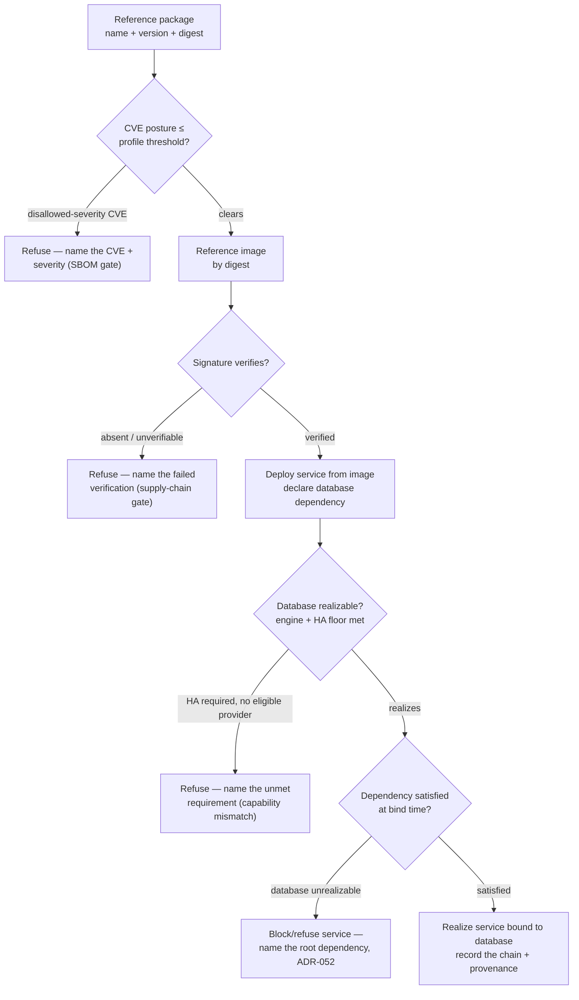

# Application-tier provisioning — package → image → service → database (the flow)

**What this settles:** how the application tier composes — a **package** and a signed **image** are admitted
to the catalog through supply-chain gates, a **service** deploys from that image, and it binds to a
**database** it depends on. A **lighter** flow: it **builds on [request-realization](request-realization.md)**
(the validate → place → reserve → realize spine) and
[uc-02-solution-architecture-deployment](uc-02-solution-architecture-deployment.md) (the multi-tier
solution); it documents only what the application supply chain adds — the two **admission gates** and the
**service→database dependency**.

> **Use Cases:** `software/reference-package`, `software/reference-signed-image`,
> `software/deploy-service-from-image`, `software/provision-database`,
> `software/composite-app-service-with-database` (positive); `software/package-cve-blocked-refused`,
> `software/image-unsigned-refused`, `software/service-missing-dependency-refused`,
> `software/database-ha-no-eligible-provider-refused` (must-reject). **Persona:** platform-engineer ·
> **Profiles:** dev / prod.

**In one breath.** A package is referenced by name+version+digest and admitted only if its CVE posture
clears the profile's threshold; an image is referenced by digest and admitted only if its signature
verifies. A service deploys from an admitted image and declares its database dependency; the database
realizes against the requirements floor (engine, HA), and the service binds to it. Four refusals gate the
chain — CVE-blocked package, unsigned image, unrealizable database, missing dependency — each a
must-reject naming its root, never a silent admit-with-warning or half-up service.

## The flow

## What the application tier adds

- **Two admission gates on Knowledge artifacts** — a package clears a **CVE/SBOM** threshold, an image
  clears **signature verification**, before either enters the catalog. These are profile-driven policy
  floors (homelab may warn; a sovereign profile blocks), evaluated as must-rejects that name the concrete
  failure — the CVE + severity, the failed signature — never a silent admit.
- **A service→database dependency** — the service declares an operational dependency on its database; the
  bind honors it, and an unrealizable database blocks the service naming the root (ADR-052), rather than a
  half-up service pointing at nothing.
- **Requirements-floor data tier** — the database's engine + HA are a requirements floor (ADR-036);
  HA-required with no eligible provider is a capability-mismatch refusal, not a silent single-node degrade.

## What UDLM does not decide

Which registry stores the image, which scanner computes the CVE posture, or which engine realizes the
database (the naturalization boundary, DCM ADR-023); the profile's exact CVE threshold and signature-trust
roots (Policy, DCM). UDLM defines the artifact + service + database shapes, the admission-gate contract as
declarative policy floors, the service→database dependency, and the surfacing contract.

## Where each piece is specified

| Piece | Contract |
|---|---|
| Requirements-floor data tier (engine/HA, not a native class) | ADR-036 |
| Operational dependency + root-cause surfacing | ADR-052 |
| Profile-driven policy floors (CVE / signature gates) | ADR-007 profiles |
| The artifact/service/database shapes + examples | `registry/resource-types/{knowledge,software,data}/*` (`spec.examples`, ADR-055) |
| Corpus | `use-cases/software/`, the three-tier composite (`registry/instances/example-catalog-item.yaml`) |
