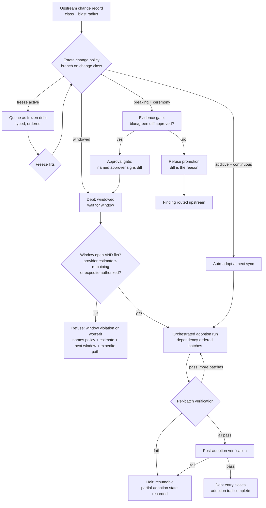

# Change-control adoption — the stage

**What this settles:** the operational flow that carries an upstream class change into an
estate under that estate's own change-management policy — who decides, what gates, and when
things actually move. The mechanics of *what* changes are settled elsewhere (ADR-045 — atomic
recompilation, pins, visible debt) and the evidence standard by ADR-046 (blue/green
typed-output diff); this flow is the calendar and the ceremony around them. It builds on
[request-realization](request-realization.md); the new twist is that the "request" is the
estate's own decision to move forward in time.

> **Use Cases:** `change-control/additive-auto-adopted-continuous`,
> `additive-deferred-to-window`, `breaking-full-ceremony`, `out-of-window-refused`,
> `staged-rollout-tiers`, `expedite-break-glass`, `freeze-queues-adoptions`,
> `intra-estate-ordered-propagation`.
> **Persona:** platform-engineer · **Profiles:** dev / prod / fsi (the regimes vary by profile).

**In one breath.** An upstream change arrives already classified (additive or breaking) with
its blast radius computed; the estate's change policy — a declared artifact, not a wiki page —
branches on that class and decides the ceremony: adopt automatically, wait for a window, or run
the full evidence-approval-window-verify sequence; waiting is always visible as typed debt
(queued, windowed, frozen), scheduling gates decide *when* but never *whether* (no clause can
waive blue/green evidence for a breaking change), and the adoption itself propagates through
downstream records in dependency-derived order, batch by verified batch, leaving one recorded
trail from classification to closed debt.

## The flow — only what's different

## What informs each decision — model surfaces, validated 2026-07-25

Each decision node reads a named UDLM surface. Every row below was resolved against the
current registry (validated here, not assumed); the status column is honest about what exists
today versus what the pending change-control ADR and the class-implementation P0 phase must
supply. The **policy role** column states whether a policy *decides* (gates, refuses, selects)
or *enriches* (adds data other steps read) at that node, and which `policy_type` from the
policy schema's existing vocabulary carries it.

| Decision / step | Model surface read | Status | Policy role — decides or enriches what |
|---|---|---|---|
| Change classified additive/breaking | the upstream change record's classification | **PENDING-P0** — the regeneration-manifest record schema | Enriches (`transformation`): stamps the change class every later gate branches on |
| Blast radius known | class graph + ADR-044 consumer manifests | Manifests **EXIST** (`registry/consumers/`); class graph **PENDING-P0** | Enriches: attaches the affected-artifact set to the change record |
| Adoption mode chosen per class | the estate's change policy (`policy_type: gating` / `orchestration_flow`) | Policy object **EXISTS** (`policy.schema.json`); the clause vocabulary (window/freeze/expedite/precondition) **PENDING-ADR** | Decides: automatic vs windowed vs full ceremony |
| Freeze suspends adoption | a dated freeze clause | **PENDING-ADR** — no temporal clause surface exists in the policy schema today (validated: no window/schedule/freeze field anywhere) | Decides: refuse-and-queue vs proceed |
| Evidence gate | the blue/green typed-output diff record | **PENDING-P1** — the promotion-evidence record shape (ADR-046) | Decides (`gating`): promotion may proceed only on clean/approved diff |
| Approval gate | named approver sign-off on the diff | **PENDING-ADR** — approval record shape | Decides (`override`-class): a human authority accepts the evidence |
| Window gate | window clause + expedite clause — **or** change-calendar Knowledge records supplied by an information provider and referenced by the policy (multi-source; authority declared per scope; stale knowledge fails closed — see docs/design/change-control-knowledge-sources.md, UC 013–015) | **PENDING-ADR** (temporal clauses; knowledge type proposed) | Decides: execute now, defer, or expedite under elevated approval |
| Propagation order | realized-entity `dependencies[]` edges (`edge_type`, ordering semantics) | **EXISTS** — the shutdown-order machinery's own surface | Enriches: derives batch order; no policy overrides structure |
| Batch verification | target types' declared outputs vs realized values | **EXISTS** ([D8.3] outputs; per-type adequacy varies) | Decides (`validation`): batch passes or propagation halts |
| Debt states (windowed/queued/frozen) | typed debt entries in estate validation output | **PENDING-ADR** — today's debt is untyped pin-lag only | Enriches: makes waiting legible and auditable |
| Adoption trail | audit records | **EXISTS** (audit-record model) | Enriches: the reconstructible history every retrospective reads |

The pattern the validation exposes: **the graph, outputs, policy machinery, and audit
substrate all exist; what is pending is precisely the vocabulary this flow's corpus family was
authored to demand** — the temporal policy clauses, the typed debt states, and the two record
shapes (change record, evidence record) already assigned to P0/P1. Nothing in this flow
requires a surface that is neither present nor already on the build list.

## The invariants

- **The policy is data.** Adoption mode, gates, windows, freezes, and expedite paths are
  clauses of a declared policy object the orchestration evaluates — never tribal process. The
  human decision is made once, in the policy, not once per change.
- **A window must *fit*, not just be open.** The provider gives an implementation time-to-complete
  estimate (its own duration is provider-specific); the window gate proceeds only if
  `estimate + margin ≤ window_remaining`. A 2-hour window cannot hold a 4-hour implementation — a
  job that won't finish is not started; it defers, batch-fits, or expedites (ADR-053 §8; the
  estimate reuses the RTO/T6 validated-time-bound machinery).
- **Scheduling gates control when; evidence gates control whether.** An expedite clause
  compresses the calendar under elevated approval and a flagged audit record; nothing waives
  the evidence gate. There is no path to a promoted breaking change without its diff.
- **Waiting is visible and typed.** Queued (freeze), windowed (scheduled), and ordinary
  pin-behind lag are distinct debt states — an estate that is behind is provably on-policy
  behind.
- **Propagation is ordered and resumable.** Downstream updates run in dependency-derived
  order, in batches, each verified before the next; failure halts with a recorded,
  resumable state. A fleet is never rewritten unordered.
- **Chains are declared, not scripted.** Multi-estate rollout is each stage's policy naming
  its predecessor's evidence as a precondition; a stage failure halts every later stage by
  construction.

## What UDLM does not decide

Who executes the orchestrated adoption run and how it schedules — that is a DCM Process-family
concern (the adoption job is automation intent like any other; see the process-migration
stage). UDLM defines the policy clause vocabulary, the debt states, the evidence records, and
the trail; DCM's engine evaluates and runs them.

## Data · Policy · Provider (required lens — SPEC-DESIGN §29)

- **Data:** the upstream change record (classification + blast radius), the typed debt states,
  the blue/green diff, the adoption trail.
- **Policy:** the change-management policy's clauses — adoption mode per change class, window,
  freeze, expedite, precondition-on-evidence — and the refusals they produce.
- **Provider:** the orchestrated adoption run (a Process-family job) executing
  dependency-ordered, batch-verified propagation under the policy's gates.

## Where each piece is specified

| Piece | Contract |
|---|---|
| Change classification, pins, debt | ADR-045 (class evolution and pinning) |
| Evidence, promotion, refusal routing | ADR-046 (blue/green promotion contract) |
| Policy clause vocabulary, debt states | [ADR-053](../adr/ADR-053-change-control-policy-vocabulary.md) (ruled; JSON-Schema shape follows) |
| Corpus cases | `use-cases/change-control/` (ride every analysis run) |
| Worked example (three regimes) | `docs/examples/change-control-walkthrough.md` |
