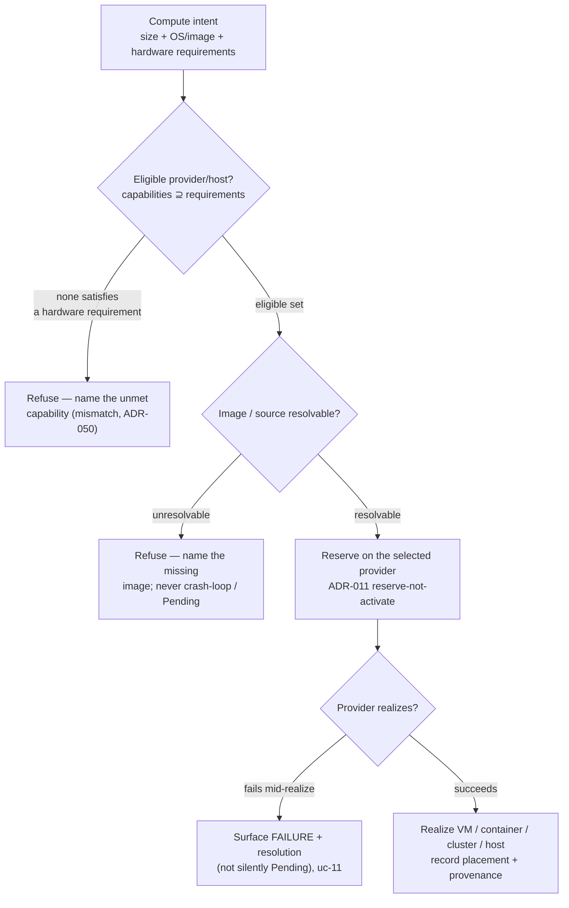

# Compute provisioning — intent → placement → capability → realize (the flow)

**What this settles:** how a compute resource (VM, container, cluster, bare-metal host) goes from intent
to implementation through **capability-gated placement** — the compute family's distinguishing stage. A
**lighter** flow: it **builds on [request-realization](request-realization.md)** (the generic
validate → place → reserve → realize spine) and the VM cases
([uc-03-vm-standard-provision](uc-03-vm-standard-provision.md),
[uc-11-vm-provision-with-provider-failure](uc-11-vm-provision-with-provider-failure.md)); it documents
only what compute placement adds — matching a requirements intent to an *eligible* provider or host, and
the two refusals that gate it.

> **Use Cases:** `compute/provision-vm-standard`, `compute/deploy-container-workload`,
> `compute/provision-compute-cluster`, `bare-metal/provision-host-from-intent` (positive);
> `compute/vm-provision-provider-failure-refused`, `compute/container-image-unavailable-refused`,
> `compute/baremetal-host-hardware-mismatch-refused` (must-reject). **Persona:** platform-engineer ·
> **Profiles:** dev / prod.

**In one breath.** A compute intent states what it needs — size, OS/image, and hardware *requirements*
(GPU, NIC, firmware), never a named host. Placement filters to providers/hosts whose declared
capabilities satisfy the floor (ADR-036 requirements-authoritative, ADR-050 capability ceiling), reserves
one (ADR-011 reserve-not-activate), and realizes. Three things gate it: **no eligible host** for a
hardware requirement → refuse naming the unmet capability; **an unresolvable image** → refuse naming it;
**a provider failing mid-realize** → surface a failure with resolution, never a silent Pending.

## The flow

## What compute placement adds over request-realization

- **Capability-gated eligibility** — the intent's hardware requirements are a floor; only providers/hosts
  whose declared capabilities meet it are eligible, and a pin may prefer among eligible but never confer
  eligibility (ADR-050). Portability holds across any provider that meets the floor.
- **Three distinct refusals, three roots** — capability mismatch (no eligible host), unresolvable image
  (container), provider failure mid-realize (VM). Each is a must-reject with a resolution, named at its
  root (ADR-052), never a silent partial or an indefinite Pending.
- **Composite reach** — a VM with an attached `Storage.Volume` carries the cross-resource dependency into
  placement (the volume must be reservable where the VM lands).

## What UDLM does not decide

Which hypervisor / runtime / kubelet realizes the compute, or how a provider naturalizes a size or image
into native form (the naturalization boundary, DCM ADR-023); the retry/give-up bound on a transient
provider failure (convergence window is DCM policy, ADR-052). UDLM defines the resource shapes, the
requirements-floor + capability-eligibility contract, and the surfacing contract; DCM's engine places,
reserves, and realizes.

## Where each piece is specified

| Piece | Contract |
|---|---|
| Requirements-floor intent (never a named host/native class) | ADR-036 |
| Capability eligibility + pins-prefer-not-confer | ADR-050 |
| Operational dependency, root-cause surfacing, reserve-not-activate | ADR-052 / ADR-011 |
| The resource shapes + their examples | `registry/resource-types/compute/*` (`spec.examples`, ADR-055) |
| Corpus | `use-cases/compute/`, `use-cases/bare-metal/`, `use-cases/multi-cluster/` |
