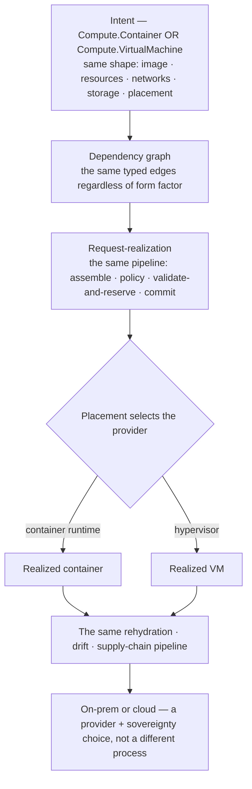

# Container lifecycle — one model with VMs, on-prem or cloud

**What this settles:** that a **container is a first-class UDLM resource** on the *same* model as a VM — the
same intent shape, the same dependency graph, the same request-realization and rehydration pipeline — so
form factor (**container vs VM**) and location (**on-prem vs cloud**) are a **provider choice, not a
different process**. It **builds on [request-realization](request-realization.md)** and is the VM
provisioning story ([uc-03](uc-03-vm-standard-provision.md)) shown to be **form-factor-neutral**.

> **Use Case:** `compute/container-lifecycle`. **Persona:** application-team-member · **Profile:** prod.

**In one breath.** `Compute.Container` and `Compute.VirtualMachine` are **peer resource types** in one
registry under one edge model, so a container is declared with the same intent shape (image, resources,
networks, storage, placement) and its dependencies are the **same typed edges**. It flows through the
**same request-realization pipeline** (assemble → policy → validate-and-reserve → commit); placement selects
the provider — a **container runtime** or a **hypervisor**, on-prem or in a cloud — and the realized record
carries provider-specific facts against the same provider-neutral intent. Everything downstream —
**rehydration, drift, supply-chain remediation** — runs the **same pipeline over the same graph**, whether
the thing is a container or a VM, on-prem or cloud. One model, one process, all four quadrants.

## The flow

## What this adds over request-realization / VM provisioning
- **Container is a peer type, not a special case.** `Compute.Container` sits beside `Compute.VirtualMachine`
  in the registry under one meta-schema and one edge model — a container's dependencies (image, network,
  storage, placement) are the **same typed edges** a VM's are.
- **The pipeline doesn't change.** Assemble → policy → validate-and-reserve → commit is identical; the only
  difference is the **provider** placement selects (a container runtime vs a hypervisor).
- **Rehydration, drift, and supply-chain are form-factor-neutral.** The dependency graph and the pipeline are
  the same, so blast-radius, rebuild-from-intent, and blue/green work the same for a container as a VM
  (uc-10 / uc-14 / [secure-software-supply-chain](secure-software-supply-chain.md)).
- **Location is a provider + sovereignty choice.** Because intent is provider-neutral, the same flow runs
  on-prem or in any cloud — the target is chosen by placement and gated by sovereignty
  ([ADR-057](../adr/ADR-057-sovereignty-placement-and-provenance.md)), not by a separate process.
- **Portability follows for free.** The same intent re-realizes on a different provider or form factor
  ([uc-18](uc-18-provider-portable-rebuild.md)); it's proven at the model level — every type round-trips
  cleanly to TOSCA.

## Success criteria (from the UC)
- A `Compute.Container` is declared with the **same intent shape** as a VM and validated against the same
  meta-schema.
- Its dependencies are the **same typed edges** in the one dependency graph.
- It flows through the **same request-realization pipeline**; only the placed **provider** differs.
- **Rehydration, drift, and supply-chain** run the same pipeline over the same graph for a container as a VM.
- On-prem vs cloud is a **placement/sovereignty** decision, not a separate process.

## Data · Policy · Provider
- **Data:** the container's intent (image · resources · networks · storage · placement), its typed edges,
  and the realized record — the same shapes a VM uses.
- **Policy:** placement (which provider / location), sovereignty, and the usual validation — identical to the
  VM path.
- **Provider:** a container runtime *or* a hypervisor realizes the intent; the model is neutral to which,
  and to on-prem vs cloud.

## Pointers
- Base flow: [request-realization](request-realization.md). Related:
  [uc-01](uc-01-vm-resource-representation.md) (VM as a first-class resource — the peer),
  [uc-03](uc-03-vm-standard-provision.md) (standard provision),
  [uc-18](uc-18-provider-portable-rebuild.md) (portable rebuild),
  [uc-10](uc-10-dynamic-rehydration.md) (rehydration),
  [secure-software-supply-chain](secure-software-supply-chain.md) (same pipeline, supply-chain trigger),
  [ADR-057](../adr/ADR-057-sovereignty-placement-and-provenance.md) (sovereignty / placement). UC source:
  `compute/container-lifecycle`.
