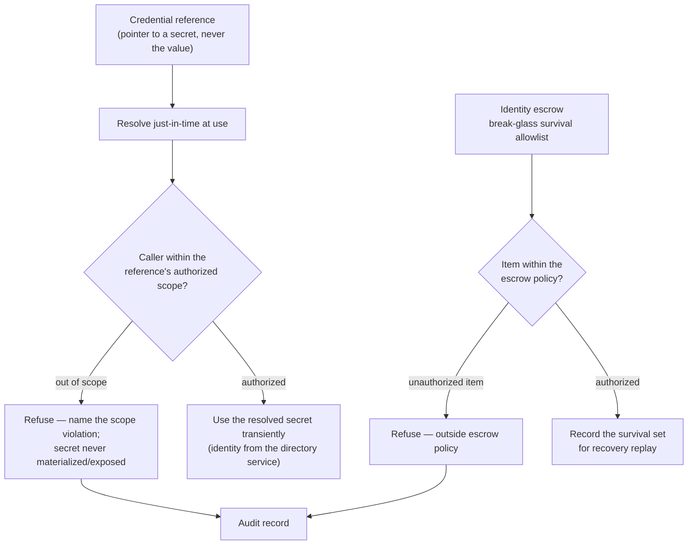

# Credential & identity — reference → resolve → scope-check → use (the flow)

**What this settles:** how secrets and identities are handled without ever pulling secret material into
the model — a **credential reference** names where a secret lives, a **directory service** is the identity
source, and an **identity escrow** declares the break-glass survival set. A **lighter** flow: it **builds
on [request-realization](request-realization.md)** and documents only what credential/identity handling
adds — the **reference-never-value** rule, **just-in-time resolution**, the **scope check**, and the
recovery survival allowlist.

> **Use Cases:** `security/reference-credential-just-in-time`, `security/integrate-directory-service`,
> `access/identity-escrow-survival-allowlist` (positive); `security/credential-used-outside-scope-refused`,
> `access/escrow-unauthorized-item-refused` (must-reject). **Personas:** security-officer /
> platform-engineer · **Perspective:** compliance-auditor.

**In one breath.** A credential reference carries a *pointer* to a secret (a path/URI/handle), never the
secret itself; it resolves just-in-time at the point of use, scope-checked against what the caller is
authorized to read, and a use outside that scope is refused with the secret never exposed. Identities come
from a directory service; an identity escrow declares which identities/accesses survive a recovery, and an
item outside the escrow policy is refused. Every refusal emits an audit record
([audit/refusal-emits-audit-record](../../use-cases/audit/refusal-emits-audit-record.yaml)).

## The flow

## What credential/identity handling adds

- **Reference, never value** — the model holds a *pointer* to a secret, never the secret. This is the
  PVD-001 portable-value discipline applied to secrets: a credential is a classified reference, resolved
  by the provider at use, so the portable model never carries material it must not.
- **Just-in-time + scope-checked** — resolution happens at the point of use, and only within the caller's
  authorized scope; an out-of-scope use is a must-reject with the secret never exposed.
- **Escrow as declared survival** — an identity escrow names the break-glass set that survives a recovery
  (the intent replayed during rehydration); items outside the escrow policy are refused.

## What UDLM does not decide

Which secret store (Vault, a KMS) holds the material, or how a provider resolves and injects it (the
naturalization boundary, DCM ADR-023); the rotation/lease policy on a resolved secret (Policy/DCM). UDLM
defines the reference shape, the scope contract, the directory-source and escrow shapes, and the surfacing
contract — never the secret itself.

## Where each piece is specified

| Piece | Contract |
|---|---|
| Reference-never-value (portable-value discipline) | ADR-037 (PVD-001) |
| Refusal ⇒ audit record | `use-cases/audit/refusal-emits-audit-record`; AUD-006 |
| Escrow replay during recovery | rehydration = replay original intent |
| The shapes + examples | `registry/resource-types/{security,access}/*` (`spec.examples`, ADR-055) |
| Corpus | `use-cases/security/`, `use-cases/access/` |
