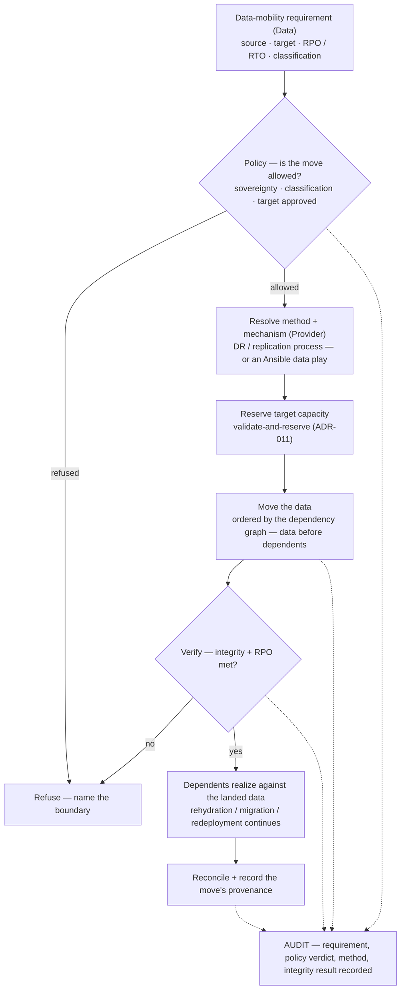

# Data mobility — moving the data for rehydration, migration, and redeployment

**What this settles:** how a workload's **data** is moved from a source to a target as part of rehydration,
migration, or redeployment — the half of the job that isn't rebuilding compute. UDLM carries the
**data-mobility requirement**; the *method and mechanism* are the **provider's** (a DR / replication
process, or an automation play), sequenced so **data lands before the systems that need it**. It **builds on
[request-realization](request-realization.md)** and grounds **ADR-003** (data mobility — requirements are
data, methods and mechanism are the provider) in a flow.

> **Use Case:** `cross-domain/data-mobility`. **Persona:** platform-engineer · **Profile:** prod.

**In one breath.** A rebuild elsewhere is only half a rehydration — the workload's data has to arrive where
it's rebuilt. The **requirement** (source, target, RPO/RTO, classification) is *data* the intent carries;
policy checks the move is allowed (**sovereignty**, classification, approved target); the *provider* resolves
the **method and mechanism** — an existing DR/replication process or an Ansible data play; the target
capacity is **reserved**; the data is **moved in dependency order** so it lands before its dependents; the
move is **verified** (integrity + RPO); then dependents realize against the landed data. The same model
serves **rehydration** (rebuild + bring the data), **migration** (move compute *and* data), and
**redeployment** (same mechanism, new target). Every step is recorded with the move's **provenance**.

## The flow

## What this adds over request-realization
- **The requirement is data; the mechanism is the provider (ADR-003).** UDLM carries *what* must move
  (source, target, RPO/RTO, classification); *how* it moves — a DR/replication process or an automation play
  — is the provider's method and mechanism, never modeled in the portable data.
- **The move is governed like any boundary crossing.** Sovereignty and data-classification gate the target
  (approved-host / zone, [ADR-057](../adr/ADR-057-sovereignty-placement-and-provenance.md)); an unapproved
  target is refused, not attempted.
- **Ordered against the dependency graph.** Data lands **before** the systems that depend on it — the same
  dependency-ordered discipline as compute rehydration ([uc-08](uc-08-cross-provider-dependency-ordering.md)).
- **Reserve, then move, then verify.** Target capacity is reserved (ADR-011) before the move; the move is
  verified for integrity and against the declared RPO before dependents proceed (T6 pre-validated outcomes).
- **One mechanism, three operations.** Rehydration (rebuild + data), migration (compute + data), and
  redeployment (new target) reuse the same data-mobility model — leveraging the DR and automation the estate
  already runs, not replacing them.

## Success criteria (from the UC)
- The data-mobility **requirement** (source, target, RPO/RTO, classification) is carried as data.
- The move is **policy-gated** on sovereignty, classification, and target approval before it starts.
- Method + mechanism are the **provider's** — a DR process or automation play — not modeled in UDLM.
- Target capacity is **reserved** before the move; the move is **verified** (integrity + RPO) before
  dependents realize.
- Data lands **before** its dependents (dependency-ordered).
- The move's **provenance** is recorded on the audit chain.

## Data · Policy · Provider
- **Data:** the data-mobility requirement (source · target · RPO/RTO · classification), the reservation, the
  integrity/RPO result, and the move's provenance record.
- **Policy:** the allow/refuse decision (sovereignty · classification · target-approved); the integrity/RPO
  verification verdict; the ordering against the graph.
- **Provider:** the DR / replication process or automation play that performs the move and reports integrity
  + provenance back.

## Pointers
- Base flow: [request-realization](request-realization.md). Grounds **ADR-003** (data mobility). Related:
  [uc-10](uc-10-dynamic-rehydration.md) (rehydration), [uc-18](uc-18-provider-portable-rebuild.md)
  (portable rebuild), [uc-08](uc-08-cross-provider-dependency-ordering.md) (dependency ordering),
  [ADR-057](../adr/ADR-057-sovereignty-placement-and-provenance.md) (sovereignty). UC source:
  `cross-domain/data-mobility`.
