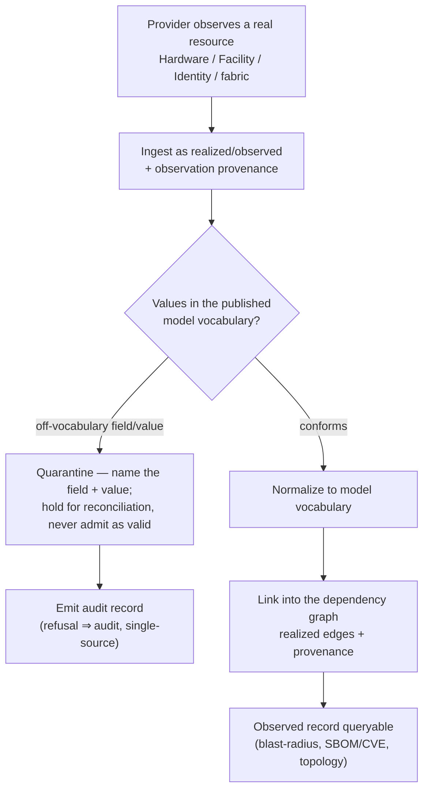

# Estate observation — observe → normalize → quarantine-or-graph (the flow)

**What this settles:** how **observed / inventory** resources enter the model — hardware components,
facility locations, directory identities, network fabric, derived topology — the resources a provider
*discovers* in the real estate rather than ones a consumer *requests*. A **lighter** flow: it **builds
on [uc-07-udlm-dependency-graph-data-model](uc-07-udlm-dependency-graph-data-model.md)** (the graph the
observations land in) and the provider contract (a provider populates the realized plane); it documents
only what observation adds — normalization to the model vocabulary, the **quarantine** gate on
off-vocabulary values, and the **refusal→audit-record** cross-cut.

> **Use Cases:** `observed/estate-resource-observed` (positive),
> `observed/observation-off-vocabulary-quarantined`, `audit/refusal-emits-audit-record` (must-reject).
> **Personas:** platform-operator / information-provider-owner · **Perspective:** compliance-auditor.
> **Types this covers:** `Hardware.*`, `Facility.*`, `Identity.*`, `Network.Switch`/`Network.VLAN`,
> `Topology` — every type populated *from* the estate rather than authored as intent.

**In one breath.** A provider observes a resource that already exists — a GPU, a BMC, a rack location, a
directory group — and ingests it as a **realized/observed** record. UDLM normalizes it to the model's
published vocabulary; a value the vocabulary doesn't define is **quarantined**, not silently blessed;
a conforming record is linked into the dependency graph with its observation provenance. Every rejection
along the way emits an audit record — auditability is stated once here, not re-derived per type.

## The flow

## What observation adds

- **Discovery, not request** — the resource exists; the provider reports it. The record lands on the
  realized plane with observation provenance (which provider, when), never as an intent to fulfill.
- **Quarantine, not silent-accept** — an observed value outside the published vocabulary is held and
  surfaced (the field + value named), not admitted as if valid. The corpus publishes the vocabulary;
  observation conforms to it or is quarantined for reconciliation.
- **Auditability stated once** — every refusal (a quarantine included) emits an immutable audit record
  (AUD-006 Merkle model). This is defined in `audit/refusal-emits-audit-record` and *referenced* by every
  refusal path, not restated — the single-source fix for a requirement that otherwise leaks into every
  scenario's analysis.

## What UDLM does not decide

How a provider discovers the resource (scan, agent, API), or its native inventory format (the
naturalization boundary, DCM ADR-023); the reconciliation workflow for a quarantined record (Policy/DCM).
UDLM defines the observed record shapes, the published vocabulary they normalize to, the quarantine
contract, and the graph they link into.

## Where each piece is specified

| Piece | Contract |
|---|---|
| The dependency graph observations land in | `uc-07-udlm-dependency-graph-data-model.md`; UDLM estate model |
| Published vocabulary + quarantine-on-off-vocabulary | corpus DIMENSION-VOCABULARY (DIM-001 pattern) |
| Refusal ⇒ audit record (single-source) | `audit/refusal-emits-audit-record`; AUD-006 |
| The observed record shapes + examples | `registry/resource-types/{hardware,facility,identity,network}/*`, `Topology` (`spec.examples`, ADR-055) |
| Corpus | `use-cases/observed/`, `use-cases/audit/` |
