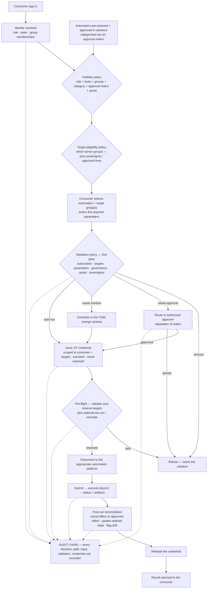

# Governed automation, end to end — the consumer journey

**What this settles:** the complete path from a consumer logging in to kick off automation to the audited
result — showing how **RBAC, policies, and metadata** (role · team · group memberships), a **pre-scan +
approval-matrix** categorization, **just-in-time credentials**, a **conditional approval / change-window**
branch, a **pre-flight reservation**, placement + execution, and **post-run reconciliation** all combine.
It **builds on [request-realization](request-realization.md)** and extends
[uc-22 (governed automation)](uc-22-governed-automation.md) — where uc-22 is the *govern-the-effect* core,
this is the *whole journey* around it.

> **Use Case:** `governance/governed-automation-journey`. **Persona:** application-team-member (consumer) ·
> **Profile:** prod.

**In one breath.** A consumer logs in; their identity resolves to a role, team, and group memberships.
Policy combines that with each automation's pre-scan **category** and the **approval matrix** the consumer
belongs to, so they **see only the automation they're entitled to run** — and a parallel policy decides
**which server groups** they may run it on. They select an automation, target group(s), and parameters; a
second **validation policy** re-checks automation, targets, parameters, quota, sovereignty, and governance,
and branches: **auto-run · needs approval (SoD) · needs a change window**. Once cleared, a **just-in-time
credential** is issued — scoped to this consumer and these targets, transient, never exposed; a
**pre-flight** validates-and-reserves the targets (optionally dry-runs) *before anything is touched*;
**placement** routes to the right automation platform; it runs (async), returns status + artifacts; a
**post-run reconciliation** checks the *actual* effect against the *approved* effect and updates the model;
the credential is released. **Every decision, path, input, and validation is recorded on the audit chain.**

## The flow

## What this adds over request-realization / uc-22
- **Discovery is policy-gated.** What a consumer can *see* is itself a policy verdict — role + team + groups
  (metadata) combined with each automation's **pre-scan category** and the consumer's **approval matrix**.
  You never see what you can't run.
- **Two policy passes.** Visibility/eligibility at *discovery*, then a full **validation pass** at
  *submission* (automation + targets + parameters + quota + sovereignty + governance) — declared intent is
  re-checked against current policy, not trusted from the menu.
- **Entitlement ≠ auto-run.** Validation branches to **auto-run / approval (SoD) / change-window** — a
  bank's elevated actions get a human and a schedule, not silent execution ([uc-16](uc-16-policy-override-approval.md); ADR-053 windows).
- **JIT, scoped credentials.** The run authenticates to targets with a **just-in-time** credential bound to
  *this* consumer and *these* targets, transient and never materialized in the model — least privilege on the
  *execution*, not a standing account.
- **Pre-flight before prod.** Validate-and-reserve the targets (optionally dry-run/simulate) *before* any
  side effect (ADR-011; T6 pre-validated outcomes).
- **Post-run reconciliation.** The **actual** effect is compared to the **approved** effect; the realized
  state updates and any deviation is flagged as **drift** (uc-14) — an automation that goes off-script is
  caught.
- **End-to-end audit.** Every step — decision, path taken, input entered, validation result, credential use
  — is a tamper-evident record (uc-15 / uc-21).

## Success criteria (from the UC)
- A consumer sees **only** the automation their role/team/groups + category + approval matrix entitle them to.
- Target server groups are constrained by policy (eligibility + sovereignty / approved-host).
- Submission re-validates automation, targets, parameters, quota, sovereignty, and governance.
- Elevated requests route to an approver (SoD) and/or a change window before running.
- Execution uses a **just-in-time, scoped** credential; nothing runs before a successful pre-flight reserve.
- Post-run, actual effect is reconciled against approved effect; deviations surface as drift.
- Every decision, path, input, and validation is recorded on the audit chain.

## Data · Policy · Provider
- **Data:** the consumer's identity + role/team/group metadata, each automation's pre-scan category +
  approval-matrix membership, the selected targets + parameters, the JIT credential *reference* (never the
  value), the reservation, the realized effect, and the audit records.
- **Policy:** the visibility, target-eligibility, and validation policies; the approval routing and
  change-window decision; the reconciliation comparison of actual vs approved effect.
- **Provider:** the automation platform realizes the run and returns status + artifacts; the credential
  provider issues the JIT credential; both report back for audit and reconciliation.

## Pointers
- Base flow: [request-realization](request-realization.md). Extends
  [uc-22 (governed automation)](uc-22-governed-automation.md). Related:
  [uc-16](uc-16-policy-override-approval.md) (approval / SoD), [uc-14](uc-14-drift-detection-remediation.md)
  (reconciliation / drift), [credential-and-identity-lifecycle](credential-and-identity-lifecycle.md) (JIT
  credentials), [ADR-041](../adr/ADR-041-policy-information-firewall.md),
  [ADR-057](../adr/ADR-057-sovereignty-placement-and-provenance.md). UC source:
  `governance/governed-automation-journey`.
