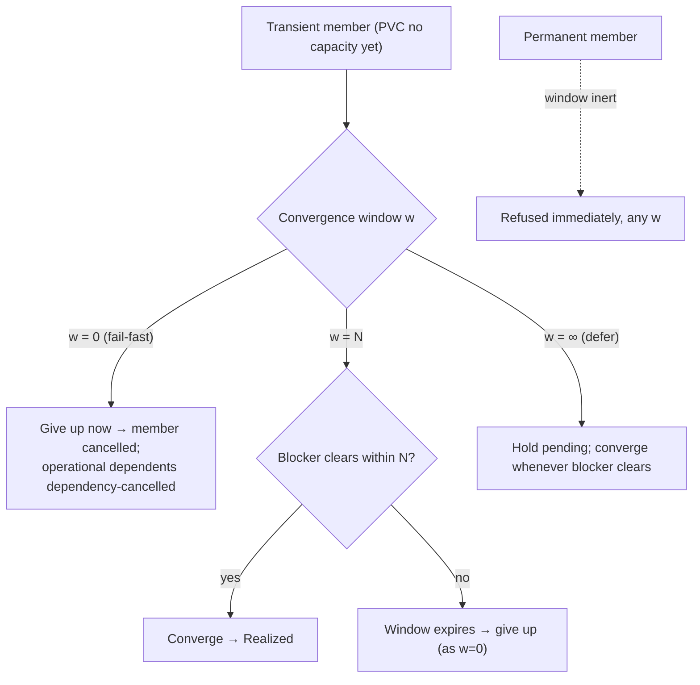

# The convergence window — staged

**What this settles:** the one converge-versus-fail-fast dial in the model — the window `w` — and
how the same transient member behaves at `w=0` (fail-fast), `w=N` (converge-then-give-up), and
`w=∞` (defer). The window is the *only* other knob beside the dependency nature, and it governs
**transient** members only. It builds on
[operational-dependency-cascade](intent-fulfillment-operational-dependency-cascade.md) (the `w>0`
case) and stages the window axis of
[`intent-fulfillment-model.md`](../design/intent-fulfillment-model.md).

> **Use Case:** `intent-fulfillment/convergence-window`. **Persona:** platform-engineer · **Profile:**
> standard.

**In one breath.** A container's PVC has no capacity yet — a transient shortfall. The window `w`
decides how long the member may converge before it is given up. At `w=0` it is given up now
(fail-fast) and its operational dependents are dependency-cancelled. At `w=N` it waits and converges
if capacity frees within the bound, else is given up when the window expires. At `w=∞` it is held
pending and converges whenever capacity frees, with no deadline. The status stays **transient**
throughout — the window governs *how long* it may converge, not *whether* it can. A **permanent**
member would be refused immediately under every `w`; the window is inert for it.

## The flow — only what's different

## Invariants

- **The window is the sole converge-vs-fail-fast dial.** No other field decides whether a stalled
  member waits or is given up.
- **It modulates transient members only.** A permanent member is refused immediately regardless of
  `w`; the six permanent matrix cells collapse across the window.
- **Give-up cascades.** When a member is given up (at `w=0` or window expiry), its operational
  dependents become `dependency-cancelled`; a request unit cancels all.
- **`w=∞` is convergence.** Deferring indefinitely is the k8s-style "hold desired state and
  reconcile" behavior — the member persists as intent until it can realize.

## What UDLM does not decide

The **default window** when the intent states none, the concrete value of `N`, and the schedule of
re-attempts — DCM policy over the window UDLM carries as an intent field (ADR-008). UDLM defines the
window as an intent field and the transient/permanent distinction it acts on.

## Data · Policy · Provider (required lens — SPEC-DESIGN §29)

- **Data:** the window `w` as an intent field on the member; the member status (transient|permanent),
  separate from `w`.
- **Policy:** `w=0` fail-fast, `w=N` converge-then-give-up, `w=∞` defer — applied to transient
  members; permanent refused immediately.
- **Provider:** the reconciliation loop re-attempts the member until it converges or the window
  expires.

## Where each piece is specified

| Piece | Contract |
|---|---|
| The model + the window axis | [`intent-fulfillment-model.md`](../design/intent-fulfillment-model.md) |
| The `w>0` operational case | [operational-dependency-cascade](intent-fulfillment-operational-dependency-cascade.md) |
| Deferred convergence (persistence) | [pending-converges-later](intent-fulfillment-pending-converges-later.md) |
| UC source | [`use-cases/intent-fulfillment/`](../../use-cases/intent-fulfillment/README.md) |
| DCM counterpart | dcm-project/dcm `docs/flows/` |
