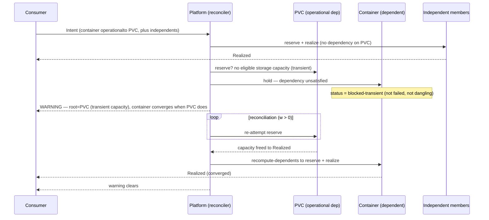

# Operational dependency cascade — the stage

**What this settles:** how an intent behaves when a member operationally depends on another that
cannot realize now for a **transient** reason — the container-needs-PVC case. The dependency
*nature* is **operational** (a Realized-layer "can't function without" coupling, directional), so
the dependent is **blocked** while its dependency is unsatisfied, and — the window being open
(`w>0`) — it **converges** the moment the dependency does. It builds on
[request-realization](request-realization.md); the new twist is that a member's implementation is
gated on another member's, and the block is *transient*, not a failure. The model this flow stages
is [`intent-fulfillment-model.md`](../design/intent-fulfillment-model.md) (the operational ·
transient rows).

> **Use Case:** `intent-fulfillment/operational-dependency-cascade`. **Persona:** platform-engineer
> · **Profile:** standard.

**In one breath.** A container operationally-hard-depends on a PVC; the PVC has no storage capacity
yet (transient). Because the coupling is operational, the container does not realize dangling
against a volume that is not there — it is classified **blocked-transient** and waits. Independent
members (a ConfigMap, an unrelated service) realize now — the operational block is scoped to the
directional chain, not the whole intent. The reconciliation loop keeps re-attempting the PVC; when
capacity frees, the PVC realizes and the container converges behind it, with no new request. The
consumer is told throughout: a warning names the **PVC as the root**, why it waits, and that the
container will converge.

## The flow — only what's different

## Invariants

- **Operational = blocked, never dangling.** A container is never realized pointing at a PVC that
  is not there; while the PVC is unsatisfied the container is `blocked-transient`.
- **The block is scoped to the directional chain.** Members with no operational dependency on the
  PVC realize now; the block does not spread to the whole intent.
- **Convergence is the existing loop.** With `w>0` the container carries no new machinery — the
  `reserve → recompute-dependents` loop realizes the PVC then the container.
- **The root is named.** The surface names the PVC (the root unsatisfied dependency), not just
  "container waiting" — the surfacing contract (UC-008) applies here.

## What UDLM does not decide

The **window value** (`w`) and whether a stalled transient member is eventually given up or waits
forever, and the schedule on which the reconciler re-attempts — those are DCM policy over the
window/nature UDLM declares (ADR-008). UDLM defines the operational nature, the `blocked-transient`
status, the convergence-order contract, and the surfacing obligation; DCM's reconciler drives them.

## Data · Policy · Provider (required lens — SPEC-DESIGN §29)

- **Data:** the operational (hard, directional) dependency edge; the container's `blocked-transient`
  status; the PVC as the named root.
- **Policy:** operational nature blocks the dependent while unsatisfied; independents proceed; the
  block is transient, so it converges rather than fails.
- **Provider:** reports no eligible storage now, then capacity freed; the PVC reserves and realizes,
  the container behind it.

## Where each piece is specified

| Piece | Contract |
|---|---|
| The model + the matrix cell | [`intent-fulfillment-model.md`](../design/intent-fulfillment-model.md) (operational · transient) |
| Reservation vs activation | ADR-011 (validate-and-reserve) |
| Edge strength (hard/soft) | `entities/service-dependencies.md`, ADR-027 |
| UC source | [`use-cases/intent-fulfillment/`](../../use-cases/intent-fulfillment/README.md) |
| DCM counterpart | dcm-project/dcm `docs/flows/` (the reconciler performing this flow) |
