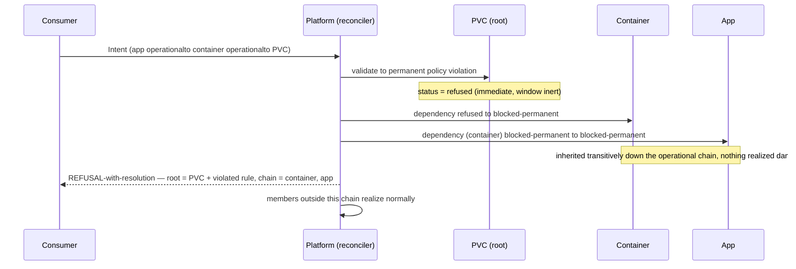

# Operational transitive refusal — the stage

**What this settles:** how a **permanent** refusal at the root of an operational chain propagates
up it — the PVC-refused-takes-the-container-and-app case. Because a permanent member is refused
immediately regardless of the convergence window, its operational dependents inherit the status
**transitively**, and the whole chain is surfaced together, naming the root. It builds on
[operational-dependency-cascade](intent-fulfillment-operational-dependency-cascade.md) (the
transient sibling) and stages the operational · permanent rows of
[`intent-fulfillment-model.md`](../design/intent-fulfillment-model.md).

> **Use Case:** `intent-fulfillment/operational-transitive-refusal`. **Persona:** platform-engineer
> · **Profile:** standard.

**In one breath.** An app operationally depends on a container, which operationally depends on a
PVC. The PVC is **permanently refused** — a sovereignty/policy violation that will never clear
unless the intent changes. Permanence ignores the window: the PVC does not wait. Its status flows
down the operational chain — the container becomes `blocked-permanent`, the app inherits the same —
and none of the three realizes dangling. The consumer gets **one** refusal-with-resolution that
names the **root** (the PVC and its violated rule) and the chain it took down, so they fix the
cause, not the symptom. Members outside this chain still realize.

## The flow — only what's different

## Invariants

- **Permanence is window-inert.** A permanently-refused member is `refused` immediately; `w` has
  nothing to act on. Waiting is never offered for something that cannot converge.
- **Status inherits transitively.** `refused` root → `blocked-permanent` dependent →
  `blocked-permanent` next-up; the operational chain carries the status the whole way.
- **One surface, rooted.** The chain is surfaced as a single refusal naming the **root** and the
  members it took down — not one opaque failure per member (UC-008 forbids naming only the
  proximate one).
- **Scoped to the chain.** Members not on this operational path are unaffected and realize.

## What UDLM does not decide

Whether the refused chain is torn down, left inert, or routed for human override, and how the
refusal is delivered — DCM policy over the statuses and surfacing contract UDLM declares (ADR-008).
UDLM owns the `refused`/`blocked-permanent` vocabulary, the transitive-inheritance semantics, and
the root-naming obligation.

## Data · Policy · Provider (required lens — SPEC-DESIGN §29)

- **Data:** the operational edges; each member's inherited status; the root PVC and its rule.
- **Policy:** permanent refusal at the root propagates as `blocked-permanent` down the chain,
  immediately; independents proceed.
- **Provider:** reports the PVC unrealizable under the violated rule; no member on the chain is
  realized.

## Where each piece is specified

| Piece | Contract |
|---|---|
| The model + the matrix cell | [`intent-fulfillment-model.md`](../design/intent-fulfillment-model.md) (operational · permanent) |
| Transient sibling | [operational-dependency-cascade](intent-fulfillment-operational-dependency-cascade.md) |
| Refusal-with-resolution surface | [surface-names-root](intent-fulfillment-surface-names-root.md) (UC-008) |
| UC source | [`use-cases/intent-fulfillment/`](../../use-cases/intent-fulfillment/README.md) |
| DCM counterpart | dcm-project/dcm `docs/flows/` |
