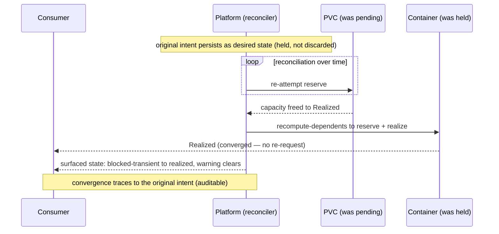

# Pending converges later — the stage

**What this settles:** the persistence proof — that a `blocked-transient` member and the operational
dependents it was holding converge **later**, via reconciliation, with no new consumer request,
because the intent is persistent desired state and not a one-shot command. It is the day-2 tail of
[operational-dependency-cascade](intent-fulfillment-operational-dependency-cascade.md) and stages the
operational · transient · `w=∞` cell of
[`intent-fulfillment-model.md`](../design/intent-fulfillment-model.md).

> **Use Case:** `intent-fulfillment/pending-converges-later`. **Persona:** platform-engineer ·
> **Profile:** standard.

**In one breath.** An intent left a container `blocked-transient` on a PVC that had no capacity
(`w>0`). Time passes. Capacity frees. The reconciliation loop realizes the previously-pending PVC and
then the container behind it — no new request is submitted, because the original intent persisted as
desired state across the gap. The consumer's surfaced state updates from `blocked-transient` to
`realized`, the shortfall warning clears, and the whole convergence is auditable back to the original
intent, with no duplicate or conflicting implementation.

## The flow — only what's different

## Invariants

- **Intent is persistent desired state.** The held members are not discarded across the gap; the
  intent remains the desired state the loop converges toward.
- **Convergence is reconciliation, not re-request.** The member realizes because its transient
  blocker cleared and the loop re-attempted it — the consumer submits nothing new.
- **The chain converges in order.** The PVC realizes, then the operational dependent behind it — the
  held chain proceeds automatically.
- **No duplicate implementation.** The deferred convergence produces exactly one realized member per
  intent member, traceable to the original intent.

## What UDLM does not decide

The reconciliation cadence and how long "later" may be before a policy gives up (the window) — DCM
policy over the desired-state model UDLM declares (ADR-008). UDLM owns the persistence semantics and
the `blocked-transient → realized` status transition.

## Data · Policy · Provider (required lens — SPEC-DESIGN §29)

- **Data:** the intent persisting as desired state; the realized state as its current projection; the
  held members carrying `blocked-transient`.
- **Policy:** reconciliation converges the transient member and its operational dependents without
  re-request.
- **Provider:** capacity frees; the PVC reserves and realizes, then the container.

## Where each piece is specified

| Piece | Contract |
|---|---|
| The model + the cell | [`intent-fulfillment-model.md`](../design/intent-fulfillment-model.md) (operational · transient · `w=∞`) |
| The initial hold | [operational-dependency-cascade](intent-fulfillment-operational-dependency-cascade.md) |
| The window that permits deferral | [convergence-window](intent-fulfillment-convergence-window.md) |
| UC source | [`use-cases/intent-fulfillment/`](../../use-cases/intent-fulfillment/README.md) |
| DCM counterpart | dcm-project/dcm `docs/flows/` |
