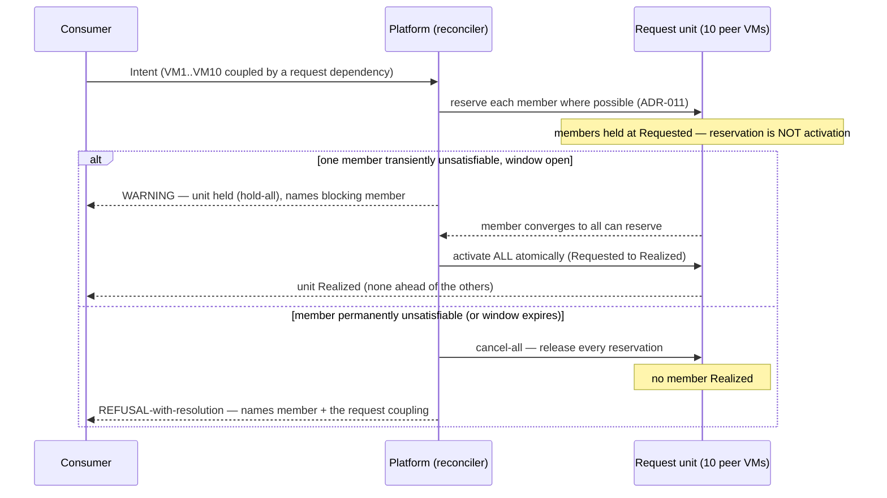

# Request dependency, atomic — the stage

**What this settles:** how a **request**-nature coupling makes a set of peers atomic — the ten-VMs
all-or-none case — without an `atomic` flag. A request dependency binds at the Intent/Requested
layer ("I want these as a unit"), and that single binding yields both atomic faces: **hold-all**
(none activates until all can) and **cancel-all** (a permanent shortfall cancels the unit). It
builds on [request-realization](request-realization.md) and ADR-011's reservation-not-activation,
and stages the request-mutual rows of
[`intent-fulfillment-model.md`](../design/intent-fulfillment-model.md).

> **Use Case:** `intent-fulfillment/request-dependency-atomic`. **Persona:** platform-engineer ·
> **Profile:** standard.

**In one breath.** Ten peer VMs are coupled by a request dependency — mutual, non-directional,
distinct from an operational "can't function without." One VM cannot be satisfied. While the window
is open, the **whole unit is held**: every member sits at Requested, reserved where possible
(ADR-011 — reservation is not activation), and no VM goes live. If the blocked member converges,
all ten activate atomically. If it is permanently unsatisfiable, the **whole coupled request
cancels** and none goes live. Hold-all up and cancel-all down are the one behavior of the request
nature. The surface names the blocking member and that the coupling binds the unit.

## The flow — only what's different

## Invariants

- **One binding, two faces.** Hold-all activation and cancel-all failure both come from the request
  nature — there is no separate `atomic` flag.
- **Reservation is not activation.** A member that reserved early is never left running while its
  siblings are held; activation happens once, for all, together (ADR-011).
- **Held at Requested, activated to Realized as a unit.** The request coupling binds at the
  Requested layer; the atomic transition is to Realized.
- **The window decides how long to hold.** `w=0` cancels the unit at once; `w=N` holds then cancels
  at expiry; `w=∞` holds indefinitely. Permanence cancels regardless of `w`.

## What UDLM does not decide

The window value, and the mechanics of a clean cancel-all (releasing reservations, any rollback of
side effects) — DCM policy over the coupling and statuses UDLM declares (ADR-008). UDLM owns the
request nature, the hold-all/cancel-all propagation semantics, and the reservation contract.

## Data · Policy · Provider (required lens — SPEC-DESIGN §29)

- **Data:** the request dependency binding the peers; members held at Requested; the atomic
  transition to Realized.
- **Policy:** request nature yields hold-all (up) and cancel-all (down) from one binding.
- **Provider:** reserves each member (ADR-011); no reservation becomes an activation until all can.

## Where each piece is specified

| Piece | Contract |
|---|---|
| The model + the matrix cell | [`intent-fulfillment-model.md`](../design/intent-fulfillment-model.md) (request-mutual) |
| Reservation vs activation | ADR-011 (validate-and-reserve) |
| The nature distinction | [request-vs-operational-distinction](intent-fulfillment-request-vs-operational-distinction.md) |
| UC source | [`use-cases/intent-fulfillment/`](../../use-cases/intent-fulfillment/README.md) |
| DCM counterpart | dcm-project/dcm `docs/flows/` |
