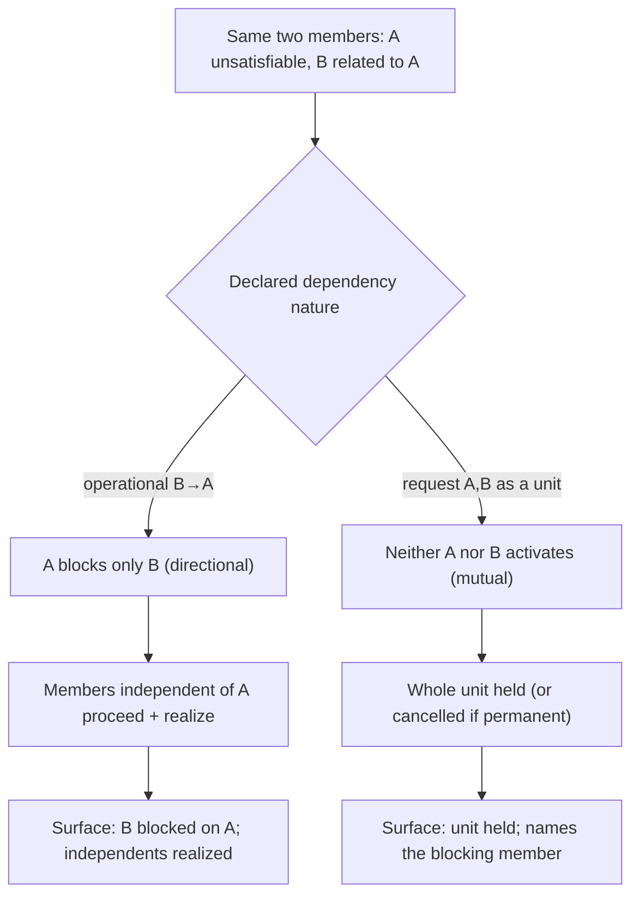

# Request vs operational — the distinction, staged

**What this settles:** that the dependency **nature** — and nothing else — is what makes the same
two members behave as a directional operational cascade or a mutual request unit. It is the hinge
of the whole model: peer-atomicity is not a flag, it is a request-nature edge, and functional
coupling is an operational-nature edge. It builds on
[operational-dependency-cascade](intent-fulfillment-operational-dependency-cascade.md) and
[request-dependency-atomic](intent-fulfillment-request-dependency-atomic.md), holding the members
fixed and switching only the nature.

> **Use Case:** `intent-fulfillment/request-vs-operational-distinction`. **Persona:**
> platform-engineer · **Profile:** standard.

**In one breath.** Take members A and B, with A unsatisfiable. Under an **operational** edge (B
depends on A, directional, Realized-layer), A blocks only B; a member independent of A proceeds.
Under a **request** edge (A and B coupled as a unit, mutual, Intent-layer), the same shortfall holds
**both** — neither activates. Neither is a defect: directional cascade with independents proceeding
is correct for operational coupling; whole-unit hold/cancel is correct for request coupling. The
platform reads the declared nature and applies the matching propagation; it never imposes one on the
other.

## The flow — only what's different

## Invariants

- **The nature is the only differing input.** Same members, same shortfall; the propagation follows
  deterministically from the declared nature.
- **Operational is directional; request is mutual.** Operational blocks the dependent and lets
  independents proceed; request couples the whole unit up and down.
- **Both are correct.** Neither behavior is audited as a defect — each is right for its nature; the
  platform enables the choice (enable-not-judge).
- **The surface distinguishes them.** A blocked directional dependent and a held mutual unit read
  differently to the consumer, each naming the driving nature.

## What UDLM does not decide

Which nature a given relationship *should* carry — that is the consumer's modeling choice, informed
by best-practice guidance, not a platform mandate; and the runtime that enacts each propagation is
DCM's (ADR-008). UDLM defines the two natures and their propagation semantics.

## Data · Policy · Provider (required lens — SPEC-DESIGN §29)

- **Data:** the dependency edge's `nature` field — the same two members differ only by it.
- **Policy:** operational propagates directionally (independents proceed); request couples the unit
  (hold-all / cancel-all).
- **Provider:** unaffected by the distinction — it reserves/realizes members as the propagation
  admits.

## Where each piece is specified

| Piece | Contract |
|---|---|
| The model + both cell blocks | [`intent-fulfillment-model.md`](../design/intent-fulfillment-model.md) |
| Operational side | [operational-dependency-cascade](intent-fulfillment-operational-dependency-cascade.md) |
| Request side | [request-dependency-atomic](intent-fulfillment-request-dependency-atomic.md) |
| UC source | [`use-cases/intent-fulfillment/`](../../use-cases/intent-fulfillment/README.md) |
| DCM counterpart | dcm-project/dcm `docs/flows/` |
