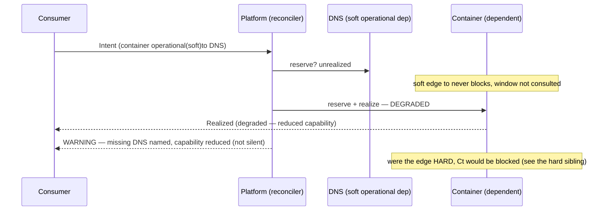

# Soft operational dependency does not block — the stage

**What this settles:** that a **soft** operational dependency never blocks its dependent — the
container-soft-depends-on-DNS case. It is the hard/soft distinction the registry already ships
(`dependencies[].strength: hard | soft`), read through the operational nature: hard operational
blocks the dependent; soft operational lets it converge **degraded** and surfaces the shortfall. It
builds on [operational-dependency-cascade](intent-fulfillment-operational-dependency-cascade.md) (the
hard sibling) and stages the soft rows of
[`intent-fulfillment-model.md`](../design/intent-fulfillment-model.md).

> **Use Case:** `intent-fulfillment/soft-operational-does-not-block`. **Persona:** platform-engineer
> · **Profile:** standard.

**In one breath.** A container operationally depends on DNS, but the edge is **soft** — better with
it, functional without it. DNS is unrealized. Because a soft operational dependency never blocks, the
container still converges and realizes — **degraded**, not blocked, not held; the window does not gate
it at all. The degradation is not silent: the container is surfaced as realized-degraded with a
warning naming the missing DNS and the reduced capability. Were the edge hard, the container would be
blocked instead — the strength is the only thing that differs.

## The flow — only what's different

## Invariants

- **Soft never blocks.** The dependent converges regardless of the soft dependency's state; it is
  never `blocked-transient` or `blocked-permanent` on a soft edge.
- **The window is inert for the dependent.** A soft dependent does not wait, so `w` does not gate it;
  the soft target's own fate follows the ordinary operational rows.
- **Degraded is surfaced, not silent.** Realized-degraded carries a warning naming the missing
  dependency and the reduced capability (`DEGRADED` / `partial_delivery`).
- **Strength is the switch.** The same edge, hard, would block; soft, it degrades. Nature names the
  layer; strength names the blocking behavior.

## What UDLM does not decide

What "degraded" operationally means for a given workload and whether an operator is paged on it —
DCM/provider policy over the degraded surface UDLM declares (ADR-008). UDLM owns the soft-never-blocks
semantics and the degraded/partial surfacing vocabulary.

## Data · Policy · Provider (required lens — SPEC-DESIGN §29)

- **Data:** the operational edge with `strength: soft`; the container realized-degraded, not dangling.
- **Policy:** a soft operational dependency never blocks the dependent — converge degraded; hard
  would block.
- **Provider:** DNS unrealized; the container is realized without it, capability reduced (`DEGRADED`).

## Where each piece is specified

| Piece | Contract |
|---|---|
| The model + the soft rows | [`intent-fulfillment-model.md`](../design/intent-fulfillment-model.md) (soft) |
| The hard sibling | [operational-dependency-cascade](intent-fulfillment-operational-dependency-cascade.md) |
| Edge strength (hard/soft), degraded | `entities/service-dependencies.md`, `contracts/provider-contract.md` |
| UC source | [`use-cases/intent-fulfillment/`](../../use-cases/intent-fulfillment/README.md) |
| DCM counterpart | dcm-project/dcm `docs/flows/` |
