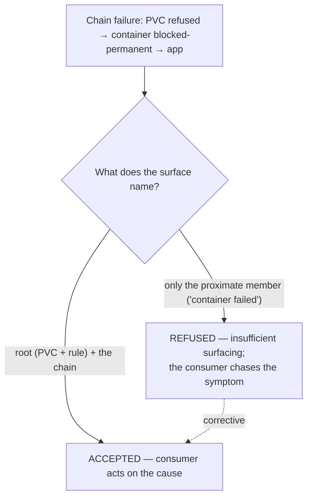

# Surface names the root — the stage (must-reject)

**What this settles:** the content obligation on the consumer surface — a chain failure must name the
**root** unsatisfied dependency and the chain it took down, not only the proximate member. A surface
that says "container failed" without naming that the container was `blocked-permanent` because its PVC
was refused is **refused as insufficient surfacing**, even though it did emit a warning. It stages the
surfacing constraint that gates every cell of
[`intent-fulfillment-model.md`](../design/intent-fulfillment-model.md), paired with
[operational-transitive-refusal](intent-fulfillment-operational-transitive-refusal.md).

> **Use Case:** `intent-fulfillment/surface-names-root` (must-reject). **Persona:** platform-engineer
> · **Profile:** standard.

**In one breath.** A PVC is refused, taking down the container that operationally depends on it and
the app above. If the platform surfaces only "container failed," the consumer is sent to fix the wrong
thing. The surfacing contract requires the **root** (the PVC and its violated rule) plus the chain, so
the consumer acts on the cause. Naming the proximate failure is not the same as naming the root; a
root-less surface does not satisfy the contract, warning or no warning.

## The flow — only what's different

## Invariants

- **Content, not just presence.** Emitting a warning is necessary but not sufficient; it must name
  the root and the chain.
- **Root over proximate.** "Container failed" is the symptom; "PVC refused (rule X) → container →
  app" is the surface the contract requires.
- **No blame-shift to the consumer.** "They could have traced the chain themselves" is not a defense.
- **Every path.** The root-naming obligation holds on every chain-failure path, transient or
  permanent.

## What UDLM does not decide

The presentation medium and channel of the surface, and any localization — DCM/runtime concerns over
the surfacing contract UDLM declares (ADR-008). UDLM owns the obligation: root dependency + chain,
always.

## Data · Policy · Provider (required lens — SPEC-DESIGN §29)

- **Data:** the surface must carry the root unsatisfied dependency and the transitive chain, not just
  the immediate member.
- **Policy:** the surfacing contract requires root + chain; naming only the proximate member is
  refused.
- **Provider:** reports the root failure; the platform composes it into a rooted surface rather than a
  proximate one.

## Where each piece is specified

| Piece | Contract |
|---|---|
| The surfacing constraint over the matrix | [`intent-fulfillment-model.md`](../design/intent-fulfillment-model.md) |
| The chain it surfaces | [operational-transitive-refusal](intent-fulfillment-operational-transitive-refusal.md) |
| The silent-partial sibling | [surfacing-mandatory](intent-fulfillment-surfacing-mandatory.md) (UC-009) |
| UC source | [`use-cases/intent-fulfillment/`](../../use-cases/intent-fulfillment/README.md) |
| DCM counterpart | dcm-project/dcm `docs/flows/` |
