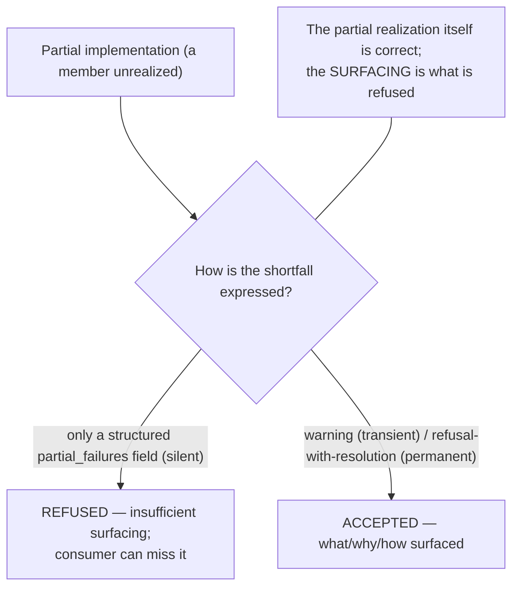

# Surfacing is mandatory — the stage (must-reject)

**What this settles:** that an unsatisfiable intent must reach the consumer as an **actionable
surface** — a warning (transient) or a refusal-with-resolution (permanent) — never only a missable
structured field. A partial realization that reports its shortfall solely as a `partial_failures`
field, with no warning, is **refused as insufficient surfacing**. A field is not a signal. It stages
the surfacing constraint that gates every cell of
[`intent-fulfillment-model.md`](../design/intent-fulfillment-model.md), paired with
[surface-names-root](intent-fulfillment-surface-names-root.md).

> **Use Case:** `intent-fulfillment/surfacing-mandatory` (must-reject). **Persona:** platform-engineer
> · **Profile:** standard.

**In one breath.** An implementation completes an intent partially and records the shortfall only as a
structured field — no warning surfaced. The consumer can miss it entirely and believe the intent was
fully satisfied. That is a silent failure, whatever the nature or window that produced the shortfall.
The mandatory surface is a warning (transient) or a refusal-with-resolution (permanent): what was not
realized, why, and how to resolve it. The refusal is of the **surfacing**, not of the partial
implementation itself — converging the satisfiable members while a transient member stays pending is
correct; hiding that behind a missable field is not.

## The flow — only what's different

## Invariants

- **A field is not a signal.** A shortfall recorded only where the consumer must go looking is not
  surfaced.
- **Transient → warning; permanent → refusal-with-resolution.** The surface form follows the member
  status; both carry what/why/how-to-resolve.
- **The refusal targets the surfacing.** Converging satisfiable members is correct; the defect is the
  silence, not the partial.
- **No blame-shift.** "They could have read the field" is not a defense.
- **Every path.** The obligation holds on every partial-fulfillment path, whatever nature or window
  produced it.

## What UDLM does not decide

The delivery channel and the exact wording of the surface — DCM/runtime concerns over the surfacing
contract UDLM declares (ADR-008). UDLM owns the obligation: an unsatisfiable intent is actively
surfaced, first-class and distinct from any structured record.

## Data · Policy · Provider (required lens — SPEC-DESIGN §29)

- **Data:** the warning / refusal-with-resolution is a first-class output, distinct from the
  `partial_failures` record.
- **Policy:** surfacing an unsatisfiable intent is mandatory, not optional; a field is not a signal.
- **Provider:** reports the shortfall; the platform must turn it into an actionable surface, not only
  a record.

## Where each piece is specified

| Piece | Contract |
|---|---|
| The surfacing constraint over the matrix | [`intent-fulfillment-model.md`](../design/intent-fulfillment-model.md) |
| The root-naming sibling | [surface-names-root](intent-fulfillment-surface-names-root.md) (UC-008) |
| Degraded / partial vocabulary | `contracts/provider-contract.md` (`partial_delivery`, `DEGRADED`) |
| UC source | [`use-cases/intent-fulfillment/`](../../use-cases/intent-fulfillment/README.md) |
| DCM counterpart | dcm-project/dcm `docs/flows/` |
