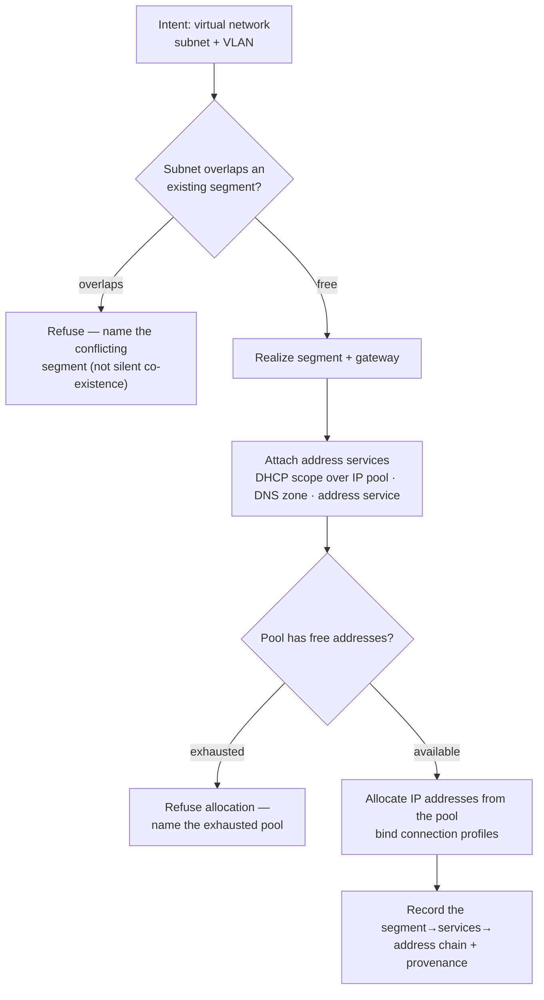

# Network provisioning — segment → gateway → address services → allocation (the flow)

**What this settles:** how the network family composes into one implementation — a **virtual network**
segment (VLAN-backed) gets a **gateway**, address services (**DHCP scope** over an **IP address pool**,
a **DNS zone**, an **address service**) attach, and **IP addresses** allocate from the pool. A **lighter**
flow: it **builds on [request-realization](request-realization.md)** and documents only what network
provisioning adds — the **subnet-overlap** gate and the segment→services→allocation dependency chain.

> **Use Cases:** `network/provision-virtual-network`, `network/configure-dhcp-scope`,
> `network/configure-dns-zone`, `network/allocate-ip-from-pool`,
> `network/composite-segment-with-services` (positive); `network/overlapping-subnet-refused`
> (must-reject). **Persona:** platform-engineer · **Profiles:** dev / prod.

**In one breath.** A virtual network declares a subnet on a VLAN; UDLM refuses it if the subnet overlaps
an existing segment (naming the conflict, not silently co-existing). A gateway, a DHCP scope over an IP
pool, and a DNS zone attach as operational dependents; IP addresses then allocate from the pool. The chain
realizes top-down, each service an operational dependency on the segment, exhaustion or overlap surfaced
at its root.

## The flow

## What network provisioning adds

- **The overlap gate** — a subnet is a shared, exclusive resource; a new segment whose subnet overlaps an
  existing one is refused at declaration, naming the conflict. This is a must-reject, not a warning.
- **A segment→services→allocation chain** — gateway, DHCP scope (over an IP pool), and DNS zone are
  operational dependents of the segment; IP addresses allocate from the pool. A failure at any link
  surfaces at its root (ADR-052), never a half-configured segment.
- **Pool exhaustion is a named refusal** — an allocation against an exhausted pool is refused naming the
  pool, not left indefinitely pending.

## What UDLM does not decide

Which SDN/fabric realizes the segment, or how a provider naturalizes a VLAN/scope/zone into native form
(the naturalization boundary, DCM ADR-023); the reclamation policy for released addresses (Policy/DCM).
UDLM defines the network resource shapes, the overlap-exclusivity + dependency contract, and the surfacing
contract.

## Where each piece is specified

| Piece | Contract |
|---|---|
| Operational dependency + root-cause surfacing + reserve | ADR-052 / ADR-011 |
| The network resource shapes + examples | `registry/resource-types/network/*` (`spec.examples`, ADR-055) |
| Observed fabric (switch/VLAN discovery) | `docs/flows/estate-observation-lifecycle.md` |
| Corpus | `use-cases/network/` |
