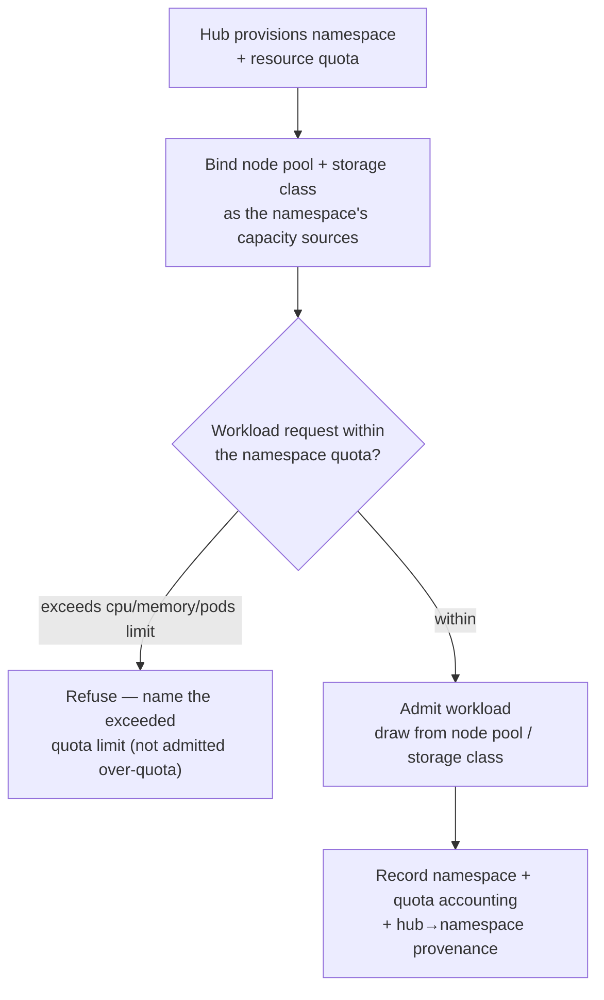

# Platform provisioning — hub → namespace + quota → node pool / storage class (the flow)

**What this settles:** how the platform family composes — a **hub** provisions a **namespace** bounded by a
**resource quota**, backed by a **node pool** and a **storage class**. A **lighter** flow: it **builds on
[request-realization](request-realization.md)** and [uc-02-solution-architecture-deployment](uc-02-solution-architecture-deployment.md);
it documents only what platform provisioning adds — the **quota** as an enforced ceiling and the
hub→namespace dependency.

> **Use Cases:** `platform/provision-namespace-with-quota`, `platform/provision-node-pool`,
> `platform/register-storage-class`, `platform/composite-hub-provisions-spoke` (positive);
> `platform/namespace-quota-exceeded-refused` (must-reject). **Persona:** platform-engineer ·
> **Profiles:** dev / prod.

**In one breath.** A hub provisions a namespace with a resource quota; workloads within it draw compute
from a node pool and storage from a storage class. The quota is an enforced ceiling — a request that would
exceed it is refused naming the limit, not admitted over-quota. The namespace is an operational dependent
of the hub; a hub-provisioned spoke realizes the dependency in order.

## The flow

## What platform provisioning adds

- **The quota ceiling** — a resource quota is an *enforced* limit, not advisory; a workload that would
  exceed cpu/memory/pod bounds is refused naming the limit. A must-reject, never a silent over-admit.
- **Hub→namespace dependency** — a spoke namespace is an operational dependent of the hub that provisions
  it; the dependency realizes in order and surfaces at its root on failure (ADR-052).
- **Capacity by reference** — node pool and storage class are the namespace's compute/storage sources,
  referenced (not embedded); portability holds across providers that offer equivalent classes.

## What UDLM does not decide

Which Kubernetes distribution / cloud realizes the namespace, or how a provider naturalizes a quota /
node pool / storage class into native objects (the naturalization boundary, DCM ADR-023); the
overcommit / eviction policy under quota pressure (Policy/DCM). UDLM defines the platform resource shapes,
the quota-as-ceiling + hub-dependency contract, and the surfacing contract.

## Where each piece is specified

| Piece | Contract |
|---|---|
| Operational dependency + root-cause surfacing | ADR-052 |
| Requirements-floor capacity (node pool / storage class) | ADR-036 |
| The platform resource shapes + examples | `registry/resource-types/platform/*` (`spec.examples`, ADR-055) |
| Corpus | `use-cases/platform/`, `use-cases/multi-cluster/` |
