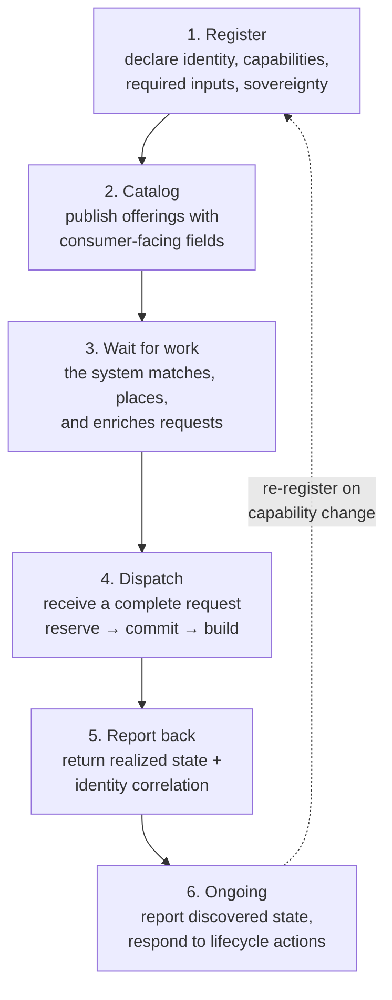
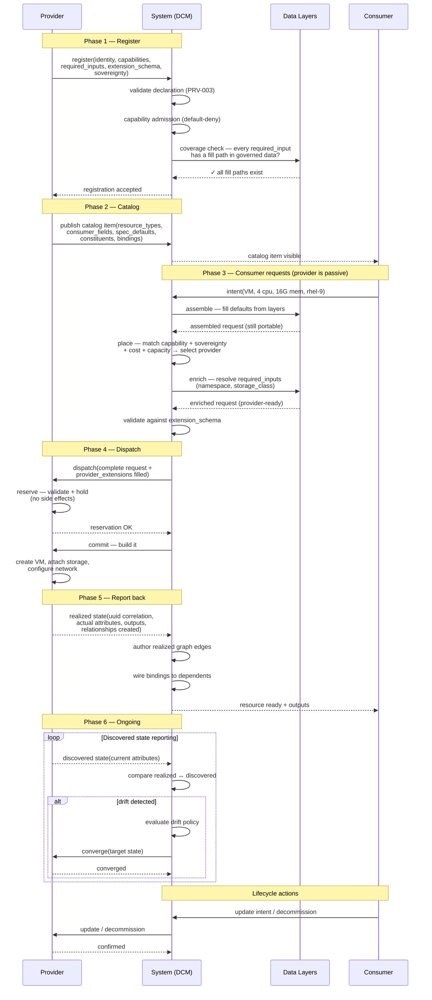

# Provider lifecycle — from the provider's perspective

**What this settles:** the complete journey a provider takes — from declaring what it can do, through
receiving and fulfilling requests, to reporting back what it built. This is the **provider's view** of the
system: what it must do at each stage, what data it supplies, and what it gets back. The companion
[request-realization](request-realization.md) tells the same story from the request's perspective; this
document tells it from the provider's.

**In one breath.** A provider registers, declares "I can provision VMs on OpenShift, and I need a namespace
and a storage class to do it." It publishes a catalog item that says "here's my VM offering with these
consumer-facing options." A consumer asks for a VM. The system picks this provider, fills in the namespace
from governed data, and hands the provider a complete request. The provider reserves, commits, builds the
VM, and reports back what it did. From then on, it reports discovered state so the system can detect drift.
The provider never sees the portable abstraction layer — it gets a request that already has everything it
needs.

## The lifecycle — six phases



### The full interaction — sequence



---

## Phase 1 — Register: tell the system what you can do

Before receiving any work, a provider registers with the system. Registration is the provider's
**declaration of identity and capability** — everything the system needs to know before it can consider
this provider for placement.

**What the provider supplies:**

| What | Why | Where it's specified |
|------|-----|---------------------|
| Identity (name, version, health endpoint) | The system needs to reach you and know you're alive | `provider-contract.md` §1 |
| Capabilities — which resource types you realize, which operations you support | The system needs to match requests to providers who can fulfill them | `capability-discovery.md` §2.1 |
| Required inputs per resource type — the fields you need beyond the portable base (e.g., `namespace`, `storage_class`) | The system needs to know what to fill in before dispatching to you | `provider-contract.md` §1a.2 |
| Extension schema — the JSON Schema for your provider-specific fields | The system validates the enriched request before dispatch; consumers who pin provider-specific fields get validation at intent time | `provider-contract.md` §1a.3, PRV-010 |
| Sovereignty zones | The system enforces sovereignty constraints at placement | `capability-discovery.md` §2.1 |
| Capacity (optional but recommended) | The system uses capacity data for placement decisions — without it, placement is capability-match only | UC-10 |

**Example — an OpenShift VM provider registering:**

```yaml
provider:
  name: "ocp-prod-east"
  version: "1.2.0"
  health_endpoint: "https://ocp-prod-east.internal/healthz"

  capabilities:
    realize_resources:
      resource_types:
        - type: Compute.VirtualMachine
          required_inputs: [namespace, storage_class]
          extension_schema_ref: "urn:udlm:schema:ocp-vm-extensions:1.0"
        - type: Compute.Container
          required_inputs: [namespace, resource_quota]
          extension_schema_ref: "urn:udlm:schema:ocp-container-extensions:1.0"
      operations: [create, update, scale, decommission]
      supports_discovery: true
      supports_capacity_query: true

  sovereignty:
    zones: [us-east-1]
```

A VMware provider registering for the same resource type would declare different required inputs:

```yaml
capabilities:
  realize_resources:
    resource_types:
      - type: Compute.VirtualMachine
        required_inputs: [cluster, datastore, resource_pool]
        extension_schema_ref: "urn:udlm:schema:vmware-vm-extensions:1.0"
```

Same portable type. Different required inputs. The system knows both at registration time and can fill
each one after placement selects a specific provider.

**What happens at registration:**
- The system validates the declaration (PRV-003: capabilities not declared at registration cannot be invoked later)
- Capability admission runs — default-deny; a platform admin must admit each capability before it's usable (§2.5)
- A coverage check verifies every `required_input` has a fill path in the governed data layers — gaps are caught here, not on a user's first request

---

## Phase 2 — Catalog: publish what consumers can order

After registration, the provider publishes **catalog items** — the consumer-facing offerings built on top
of registered capabilities. A catalog item is the menu: what a consumer sees when they browse what's
available.

**What the provider supplies:**

| What | Why |
|------|-----|
| Resource type + version | Which portable type this offering realizes |
| Consumer fields | What the consumer fills in at intent time (environment, domain, replicas — business-level choices) |
| Spec defaults | Sensible defaults for the portable fields the consumer doesn't specify |
| Constituents + dependencies (for composites) | How a multi-tier offering decomposes and in what order |
| Bindings | How one constituent's output wires into another's input |

**Example — a three-tier app catalog item:**

```yaml
name: ApplicationStack.ThreeTierWebApp
constituents:
  - component_id: database
    resource_type: Data.Database
    depends_on: []
    spec_defaults:
      engine: postgresql

  - component_id: app
    resource_type: Compute.Container
    depends_on: [database]
    bindings:
      - from_component: database
        output: connection_string
        to_field: env.database_url

  - component_id: web
    resource_type: Compute.Container
    depends_on: [app]
    bindings:
      - from_component: app
        output: internal_dns
        to_field: env.upstream_host

consumer_fields:
  - name: environment
    type: enum
    enum_values: [dev, staging, prod]
  - name: domain
    type: string
  - name: replicas
    type: integer
    default: 2
```

The consumer never sees `namespace` or `storage_class` here — those are provider internals resolved by
the system. The consumer sees `environment`, `domain`, `replicas` — business choices.

---

## Phase 3 — Wait: the system does the matching

The provider does nothing in this phase. The system handles:

1. **Intent** — a consumer asks for a VM (or a three-tier app, or a database)
2. **Assembly** — data layers fill in defaults (profile, tenant, platform layers)
3. **Placement** — policies narrow to eligible providers based on capability match, sovereignty,
   cost, capacity, and consumer constraints
4. **Enrichment** — a post-placement policy reads governed data and fills in the provider's
   `required_inputs` (e.g., resolves `namespace` for OpenShift from a tenant-to-namespace mapping)
5. **Validation** — the enriched request is checked against the provider's `extension_schema`

The provider's registration (Phase 1) and catalog items (Phase 2) are the inputs the system uses. The
provider is passive until dispatch.

---

## Phase 4 — Dispatch: receive a complete request and build it

The provider receives a **fully enriched request** — portable base fields plus all provider-specific
fields filled in. It never receives an incomplete request; the system's validation (Phase 3) guarantees
that.

**What the provider receives:**

```yaml
resource_type: Compute.VirtualMachine
spec:
  vcpu: 4
  memory: 16384
  guest_os: rhel-9
  disks:
    - size_gb: 100
      type: ssd
  networks:
    - name: prod-vlan-40

provider_extensions:
  ocp-prod-east:
    namespace: "tenant-alpha-prod"
    storage_class: "ceph-rbd-fast"

request_context:
  tenant_uuid: "75ccf4ff-..."
  sovereignty_zone: "us-east-1"
  intent_uuid: "a1b2c3d4-..."
```

**What the provider does — two-phase realize:**

1. **Reserve** — validate the request against its own systems, hold resources (capacity, IP, name),
   but create nothing. No side effects. If the request can't be fulfilled, return a clear error
   with the specific field or constraint that failed. The system may loop (re-enrich and re-reserve)
   until the reservation converges.

2. **Commit** — build it. Create the VM, attach the storage, configure the network. This is the
   only step where real infrastructure changes happen.

Both MUST be **idempotent** — the system may re-drive either step on failure or restart.

---

## Phase 5 — Report back: tell the system what you built

After commit, the provider reports the **realized state** — the receipt of what was actually created.

**What the provider returns:**

| What | Why |
|------|-----|
| Identity correlation (`udlm_uuid` ↔ provider-native id) | The system tracks the resource across both worlds |
| Realized attributes (actual CPU, memory, IP, FQDN, storage path) | The system records what was delivered vs what was requested |
| Outputs (connection strings, endpoints, DNS names) | Downstream constituents bind to these via the catalog item's `bindings` |
| Relationships created (storage attached, network assigned) | The system builds the realized dependency graph from these |

**Example — realized state report:**

```yaml
udlm_uuid: "a1b2c3d4-..."
provider_native_id: "ocp-prod-east/tenant-alpha-prod/vm-0042"
status: active

realized:
  vcpu: 4
  memory: 16384
  fqdn: "vm-0042.tenant-alpha-prod.ocp-east.internal"
  ip_address: "10.128.4.42"
  storage_path: "/dev/rbd0"

outputs:
  internal_dns: "vm-0042.tenant-alpha-prod.ocp-east.internal"
  ssh_endpoint: "10.128.4.42:22"

relationships_created:
  - type: attached
    target_type: Storage.Volume
    target_native_id: "ceph/pvc-a1b2c3"
  - type: connected
    target_type: Network.VLAN
    target_native_id: "vlan-40"
```

The system authors the realized relationships from this report — the provider supplies the
correlation, the system sets the edges in the graph.

---

## Phase 6 — Ongoing: keep the system informed

After realization, the provider has ongoing obligations:

**Discovered-state reporting.** Periodically (or on change), report the current state of every resource
the provider manages. The system compares discovered state against realized state — mismatches are drift,
and policies determine the response (alert, re-converge, or escalate).

**Lifecycle actions.** Respond to system-driven lifecycle actions:
- **Converge** — the system asks the provider to bring a drifted resource back to its intended state
- **Update** — a consumer changes their intent; the system re-enriches and dispatches the delta
- **Scale** — increase or decrease a resource's capacity
- **Decommission** — tear down the resource and confirm removal

**Re-registration.** If the provider's capabilities change (new resource types, changed required inputs,
new sovereignty zones), it re-registers. The coverage check runs again to verify fill paths.

---

## The full chain — one picture

```
Provider                          System                           Consumer
────────                          ──────                           ────────
1. Register
   → capabilities
   → required_inputs
   → extension_schema
   → sovereignty
                                  ← admit capabilities
                                  ← verify fill paths

2. Publish catalog items
   → consumer_fields
   → spec_defaults
   → constituents + bindings
                                  ← catalog visible to consumers
                                                                   Browse catalog
                                                                   Submit intent
                                  Assemble (layers)
                                  Place (match + select)
                                  Enrich (fill required_inputs)
                                  Validate (against extension_schema)

3. (passive)

4. Receive dispatch
   ← complete request
   → reserve (validate + hold)
   → commit (build)

5. Report realized state
   → identity correlation
   → realized attributes
   → outputs
   → relationships
                                  Author realized graph
                                  Wire bindings to dependents
                                                                   See result

6. Ongoing
   → discovered state (periodic)
                                  Compare realized ↔ discovered
                                  Detect drift → policy response
   ← converge / update / decommission
   → confirm action
```

---

## Pointers

- The request's perspective on the same flow: [request-realization](request-realization.md)
- Provider base contract (what you MUST implement): `contracts/provider-contract.md` §1a
- Capability advertisement shape: `contracts/capability-discovery.md` §2.1
- How required inputs get filled: `docs/adr/ADR-024-filling-provider-required-inputs.md`
- Policy contract (enrichment policies): `contracts/policy-contract.md` §12
- Catalog item schema: `registry/catalog-item.schema.json`
- Resource type extension rules: `contracts/provider-contract.md` PRV-010
- Realized entity schema: `registry/realized-entity.schema.json`
- Provider registration UC: [UC-10](uc-10-provider-registration-capability.md)
