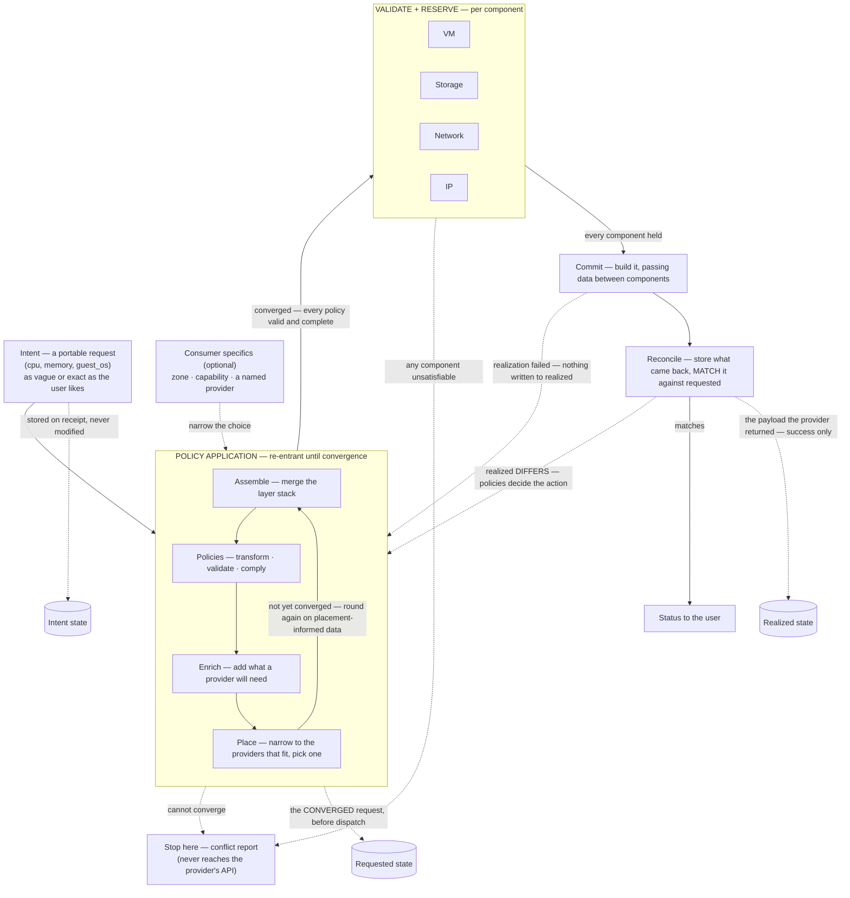
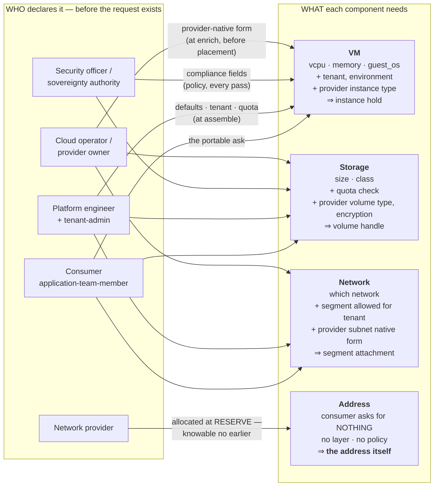

# Request implementation — the stage

**What this settles:** how an abstract, portable request becomes one a *specific* provider can actually
build — filled in and checked before anything is created. This is the model's telling: the pieces in play
and the rules that always hold, told without reference to any particular engine. How a real engine performs
it is the DCM companion, [`docs/flows/request-realization.md`](https://github.com/dcm-project/dcm/tree/main/docs/flows/request-realization.md).

**In one breath.** A user asks for *a VM this size*; the Kubernetes-specific parts like the `namespace` are
usually left to the system to fill in. The system picks a provider, fills in whatever that provider needs
(Kubernetes wants a `namespace`; an enterprise virtualization platform wants a `cluster`), checks the result is complete, and only then
builds it. Portable in, provider-ready out — never dispatched half-built.

## Start vendor-agnostic; add specifics on top

Every request starts from a **vendor-agnostic base**. A portable `Compute.VM` carries the things
true of *any* VM — `guest_os`, size, disks, networks — and deliberately leaves out one provider's mechanics
like Kubernetes' `namespace`. Keeping those off the base is what makes the type portable: another provider
can still read it ([ADR-016](../adr/ADR-016-resource-type-role-graph-audit-not-config.md) — the type models
the graph and audit surface; provider-specific config is stored separately).

Provider-specific details get added *on top* of that base, and there are two ways in:

- **The system adds them** after it picks a provider — the usual path, and the flow below.
- **The consumer adds them at intent time** — a consumer *may* pin a `namespace`, a vendor QoS class, any
  provider-specific element, right in the request. That's allowed and honored; it's simply **flagged as
  breaking portability** so the trade is explicit (realized-entity `portability` block).

So the base is always portable, and going beyond it is a choice made with eyes open. The running example
takes the common path: *the user gave cpu and memory, left the Kubernetes specifics to the system, and
Kubernetes needs a `namespace` — where does it come from?* The answer is a real step in the flow.

## The flow



**Read the block, not the arrows.** The loop runs **assemble → validate → enrich → placement**, then
round again — until every policy is valid and complete. Layer assembly, transformation, validation and
enrichment all happen *before* placement; placement is the last step of an iteration, and its result is
data the earlier steps have not seen. There is no separate post-placement phase: **the post-placement
work is the next iteration.** Only once it converges does each component validate and reserve, and only
when all of them hold does anything commit.

**Three stores, three moments.** The **intent** is what the consumer asked for, stored on receipt and
never modified. The **requested** state is what the system decided to ask the providers for — it exists
only once the loop converges, which is what makes it storable. The **realized** state is the payload the
provider returned, stored on success only.

**Policy is engaged three times in one request** — and that is the thing worth carrying away:
convergence before dispatch, the response when realization fails, and the action when realized differs
from requested. Same mechanism, three moments. A failure writes nothing to realized; a difference is not
resolved here either — policies decide whether to notify, to instruct the provider to change the
resource, or to update the request where the provider's change is the one that has to win.

> This is the readable on-ramp. The **authoritative** assembly process (nine steps, with
> the exact layer-resolution and policy phases) is [`docs/spec/foundations/layering-and-versioning.md`](../spec/foundations/layering-and-versioning.md)
> §6. Where the two differ, the spec wins.

Step by step, with `namespace` threaded through. The numbering is what each step *does*, not a promise
that each runs once: steps 2–4 plus policy are the re-entrant block above.

**1. Intent — the user asks for what they want.** The **required** part is the portable base — the user is
never *forced* to supply anything provider-specific. They *may* add provider-specific extensions (even the
`namespace`) if they want; those are honored and flagged as non-portable. How much they pin down is their
choice, from vague to exact — see [the specificity scale](#the-specificity-scale). In the common case they
leave the provider-specifics to the system.

**2. Assemble — fill in the defaults.** The data layers (platform, profile, tenant, then the user's own
values on top) resolve the fields, and every field remembers where its value came from. The request now has
cpu, memory, guest_os — still no `namespace`, because no layer on a portable type carries a provider-specific
field.

**3. Enrich — add what a provider will need.** The system fills what the portable request does not carry
— here, `namespace`. The value lands in the provider's Provider-Class element (ADR-038 — off the portable
Base/Type Class) with its origin recorded, and `enrichment_status` moves toward `complete`. *Where* the
value comes from is the organization's choice — see
[Where the value comes from](#where-the-value-comes-from).

**4. Place — pick a provider that fits.** The system narrows to the providers that satisfy the request and
the policies (sovereignty, cost, capability), then picks one. The vaguer the request, the more providers fit
and the more the system decides; the more exact, the fewer fit.

Placement is the **last step of an iteration**, not the end of the road. What it chooses is data steps 2–3
have not seen, so the payload goes round again — re-assembled, re-validated, re-enriched, and re-placed —
until nothing changes. That is why there is no "post-placement" step in this list: **the post-placement
work is the next pass through steps 2–4.**

**5. Validate + reserve — check before building, per component.** A request is rarely one resource: a VM
carries storage, a network attachment, and an address, each a separate component with its own provider and
its own way of failing. **Every** component validates against its provider's requirements and takes a hold —
without creating anything — and only when all of them hold does the flow commit (ADR-011). Reserving also
lands facts that did not exist before (an address, a volume handle, a segment), which can re-trigger policy
evaluation. Still missing something → the request stops here with a clear, field-level error. An incomplete
VM never reaches the provider's API; the gap surfaces as a plain validation failure, not a runtime crash.

**6. Commit — build it.** The providers create the resources, passing data between components as each is
built (the VM needs the volume handle to attach it, the segment attachment to connect). Typically that data
was already pulled during validate-and-reserve; a component may need more during final provisioning. Each
reports back what it built and the id that ties the UDLM record to the provider's native one, and DCM
records the result. What was *asked* and what was *built*
are both stored, so they can be compared later.

## Who provides what, and when

**The four questions this model has to answer — who, what, and when. Deliberately not how.**

This is the *lifecycle* answer and it holds for every use case. A `uc-NN` flow states only what its
own case adds: its persona, its components, the data particular to it.

### 1. The personas

| Persona | What they do for this request | When |
|---|---|---|
| **application-team-member** | Submits the intent. This is the *only* per-request actor. | at request |
| **platform-engineer** | Maintains the data layers that supply defaults (environment, zone, tags). | before, standing |
| **tenant-admin** | Binds the tenant: isolation, quota, which storage classes and networks it may use. | before, standing |
| **security-officer** · **sovereignty-authority** | Author the policies that constrain where and how the request may be realized. | before, standing |
| **cloud-operator** · **provider-owner** | Declare the provider's capabilities, capacity, and — where sovereign — residency guarantees. | before, standing |

**Only one persona acts per request.** Everything else was declared earlier as governed data — which is
the point: a request succeeds because other people's declarations were already in place, not because
someone was asked at the time.

### 2. What a user request contains

Only the **portable** fields the type declares as consumer-supplied:

```yaml
resource_type: Compute.VM
vcpu: 4
memory: 16GiB
guest_os: <reference to a governed OS image>
network: <reference to a governed network>
storage: [{ size: 100GiB, class: <reference to a governed storage class> }]
```

What a consumer **never** supplies: the provider, the host, the datastore path, the namespace, the IP
address, the volume handle. Those are either derived or supplied by someone else. A consumer *may*
narrow the choice (a zone, a required capability, even a named provider) — that is allowed and recorded
as a non-portable pin, but it is **narrowing**, not placing.

### 3. What must be added before a provider can act — and who supplies it

| What is added | Who supplies it | When |
|---|---|---|
| Defaults — environment, zone, tags | the data layers (platform-engineer) | assemble |
| Tenant identity, quota, allowed classes | the tenant binding (tenant-admin) | assemble |
| Compliance-driven fields and constraints | policies (security-officer, sovereignty-authority) | policy application |
| **The provider** | **nobody — derived by placement** | placement |
| Provider-specific fields (namespace, storage class native form) | the Provider Class declaration (provider-owner / cloud-operator) | enrich — **before** placement, refined each pass |
| Reserved facts — the IP, the volume handle, the segment | the provider, at reserve | validate + reserve |

Every one of these records **who set it** — field-level provenance is not a nice-to-have here; it is how
this table is answerable after the fact for a specific record.

### 4. Which persona sets placement

**None.** Placement is **derived** — the engine narrows to providers whose declared capability and
capacity satisfy the request, and whose selection satisfies every applicable policy. It is an *outcome*
of data other personas declared, not a decision anyone makes at request time.

This is the single most important thing to take from this flow. If a request lands somewhere unexpected,
nobody "set" it wrongly: either a capability declaration, a capacity advertisement, or a policy said so.
The placement record names which.

### 5. When policy is engaged — three times, not once

The clearest answer to *when*:

| # | Moment | What policy decides |
|---|---|---|
| 1 | **Convergence**, before dispatch | whether the payload is valid and complete — the loop |
| 2 | **On failure** of realization | the response. Nothing is written to realized; most likely the user is told |
| 3 | **On difference**, after realization | the action — notify, instruct the provider to change the resource, or update the request where the provider's change is the one that has to win |

Same mechanism, three moments. Neither UDLM nor DCM has a built-in action for (2) or (3): the model
carries the facts, policy carries the decision. A profile may extend what the options are.

### The three stores

| Store | What it holds | Written |
|---|---|---|
| **Intent** | what the consumer asked for | on receipt, never modified afterwards |
| **Requested** | what the system decided to ask the providers for | once the loop converges — that is what makes it storable |
| **Realized** | the payload the provider returned | on success only |

Reconcile matches **realized against requested** — which is why the middle one has to exist as a stored
record rather than a transient payload.

---

## Worked example — a VM with network and storage

One request, four components. Each needs different data, from a **different source**, at a **different
moment** — which is the whole reason this example is worth drawing rather than listing.



Read it as columns: **who** on the left, **what** in the middle, and the *when* on each arrow.

| Component | Consumer declares | Added at assemble/policy | Added at enrich (provider known) | Reserved fact |
|---|---|---|---|---|
| **VM** | vcpu, memory, guest_os | tenant, environment, compliance fields | the provider's instance type, image in native form | instance hold |
| **Storage** | size, storage class | quota check against the tenant's bound classes | the provider's volume type, encryption per policy | volume handle |
| **Network** | which network | segment allowed for this tenant | the provider's subnet in native form | segment attachment |
| **IP** | *nothing* | — | address family / pool from the segment | **the address itself** |

**The IP row is the teaching case.** The consumer never mentions an IP, no layer carries one, and no policy
sets one. It exists only as a *reserved fact* — the network provider allocates it during reserve and hands
it back, and it becomes part of the record with the provider named as its source. It cannot be known
earlier, which is exactly why reserve exists as its own phase before commit.

**Data flows between components at commit.** The VM needs the volume handle to attach it and the segment
attachment to connect. Those are pulled during validate-and-reserve in the ordinary case; a component may
need more during final provisioning, and the commit phase passes it as each is built.

**Four sources, four moments** — the table above is the same story in reference form: the consumer at
request time, the layers and tenant binding at assemble, policy on every pass, the provider's native form
at enrich (before placement), and the reserved facts at reserve. No single actor could have supplied all
of it, and no earlier moment could have produced the address.

---

---

## It converges — the flow isn't one straight pass

The line above is the *shape*, not a promise of a single pass. The policy and assembly engines are
**re-entrant**: once a provider is chosen, the provider-specific data enrichment adds can change what the
policies see, so they re-evaluate — and reserve is a **reconciliation loop** of its own, landing reserved
facts (a placement, an address, a hold) and re-running the participating policies until the whole picture is
stable. The engine loops around *place → enrich → evaluate → reserve* until it reaches a fixed point, then
commits once. Re-evaluation is idempotent by contract, so it converges rather than thrashes.
([ADR-006](../adr/ADR-006-convergence-control-model.md) — re-entrant policy and convergence;
[ADR-011](../adr/ADR-011-validate-and-reserve.md) — validate-and-reserve; and the placement loop /
reserve-phase participation in [`layering-and-versioning.md`](../spec/foundations/layering-and-versioning.md).)

## Where the value comes from

Step 4 fills a field the request didn't *already* carry — `namespace`. (If the user supplied it at intent
time, it's already set — flagged non-portable — so this step leaves it alone.)

The value lives in **data**, and a **policy selects it** — the model's original split at work: *layers set
the stage for data; policies refine and validate it* ([ADR-024](../adr/README.md)).
A governed layer holds the values — the tenant's namespace, or a small table of provider → value — and a
post-placement enrichment policy looks up the right one for the chosen provider and injects it. The value
stays data; the only logic is the lookup.

If the data has no entry for the chosen provider, the policy stops with a clear reason ("no namespace mapping
for Kubernetes VMs") — caught at reserve, never a silent gap. A plain layer default still covers fields that
aren't provider-conditional and need no selecting.

Whichever value wins is recorded in provenance, and a compliance policy can still override it for sovereignty
or security (the merge precedence, [`layering-and-versioning.md`](../spec/foundations/layering-and-versioning.md)
§5–§5a). What the model insists on is only the outcome: **every field the provider requires has a value, with
a recorded origin, before reserve.**

## The specificity scale

A request can be as vague or as exact as the user wants, and the system handles the whole range the same
way. The three points below are markers on one scale, not three separate cases:

| Request | What the user pins down | Providers that fit | Who chooses |
|---|---|---|---|
| **Abstract** | Just the essentials — a VM, cpu, memory, guest_os | Widest — any provider of the type | The system picks the best |
| **Partial** | A few things that matter — a region, a capability, a network | Narrowed to those that fit | The system picks within that |
| **Finite** | The placement itself — a named provider or cluster | Smallest — often exactly one | The user chose; the system just checks it's allowed |

Placement always does the same thing: start with every provider of the type, keep the ones that satisfy the
user's specifics *and* policy, pick from what's left. Abstract is that with no user specifics; finite is it
narrowed to one; partial is everything between. **Adding detail only ever narrows the choice** — it can't
widen it past what policy allows.

**The trade:** ask for less and get flexibility (more providers fit, the system optimizes, the resource
stays portable); ask for more and get precision (fewer fit, and you may tie the request to one provider's
ground). Neither is more correct — it's the user's call, and the flow runs the same either way.

(Grounded in the specificity spectrum, `docs/spec/contracts/policy-contract.md` §2.4; the request `placement` block;
and soft-vs-hard dependencies, `docs/spec/contracts/provider-contract.md` §1b — "any resolvable name" vs "this exact
FQDN" is the same idea one level down.)

## The rules that always hold

Whatever engine runs this flow:

- **The required data is portable** — the user is never *required* to supply anything provider-specific; the
  portable base is always enough. They *may* add provider-specific elements at intent time — that's allowed
  and honored, and flagged as breaking portability ([ADR-016](../adr/ADR-016-resource-type-role-graph-audit-not-config.md); realized-entity `portability` block).
- **How much to pin down is the user's dial, and it only narrows** — every request from abstract to finite
  is valid; more detail means fewer providers fit, never more.
- **Nothing is built until it's complete** — reserve checks the filled-in request against the provider's
  requirements first; an incomplete request is stopped, not dispatched.
- **Every value remembers where it came from** — a layer, the user, a policy, or a default; and
  `enrichment_status` says honestly whether it is `pending`, `partial`, or `complete`.
- **Provider-specific values stay off the portable type** — they are Provider-Class `SharedDataElement`s
  (ADR-038; the retired `provider_extensions` carrier is removed), flagged as non-portable
  ([ADR-016](../adr/ADR-016-resource-type-role-graph-audit-not-config.md); realized-entity `portability` block).
- **"Enough" is the provider's to define** — the provider's required-data schema is what "provider-ready"
  means; the system doesn't guess it.

## What UDLM leaves to DCM

UDLM sets the stage; it doesn't perform. These are the engine's to decide (see the DCM companion):

- **The engine itself** — how assembly, placement, and enrichment are wired and ordered.
- **The actual enrichment rules** — the real `namespace = f(tenant)` rule is content an organization writes;
  UDLM guarantees the *step* exists and checks its result, DCM supplies the *rule*.
- **How a provider is scored, and how reserve/commit are called.**

The performance: [dcm-project/dcm `docs/flows/request-realization.md`](https://github.com/dcm-project/dcm/tree/main/docs/flows/request-realization.md).

## Data · Policy · Provider (required lens — SPEC-DESIGN §29)

- **Data (UDLM):** the portable request, the four states, Provider-Class elements (ADR-038) for provider-specific
  values, and the provenance behind every field.
- **Policy (DCM/org):** which provider gets chosen, and how the provider-required fields get filled.
- **Provider:** declares what it needs ("enough"), and checks the request at reserve.

## Where each piece is specified

| Piece | Governing spec |
|---|---|
| Provider-specific config off the portable type | [ADR-016](../adr/ADR-016-resource-type-role-graph-audit-not-config.md) · ADR-038 (Provider-Class elements) |
| Provider declares the data it requires | `docs/spec/contracts/provider-contract.md` §base-level #2 |
| Data layers + provider-aware enrichment | [`docs/spec/foundations/layering-and-versioning.md`](../spec/foundations/layering-and-versioning.md) |
| Enrichment as a policy | `docs/spec/contracts/policy-contract.md` §12 |
| Reserve-then-commit (check before build) | [ADR-011](../adr/ADR-011-validate-and-reserve.md) |
| The four states (Intent → Requested → Realized) | [`docs/spec/foundations/four-states.md`](../spec/foundations/four-states.md) |
