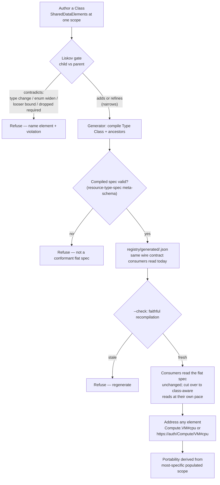

# Scoped-Class lifecycle — author, extend, compile, resolve (the flow)

**What this settles:** the operational flow of the scoped-Class system (ADR-038) — how a Class of
`SharedDataElement`s is authored, extended under the Liskov invariant, compiled into the flat
resource-type spec consumers already read, and addressed. The *what* (the model) is ADR-038; the
*references-context / projection* axis is ADR-054; this is the authoring-to-cutover machinery around
them. Builds on [request-realization](request-realization.md).

> **Use Cases:** `scoped-class/author-scoped-class`, `liskov-refine-accepted`,
> `liskov-contradict-refused`, `portability-derived-from-scope`, `compile-type-to-flat-spec`,
> `multi-provider-engine-swap`. **Persona:** platform-engineer · **Profiles:** dev / prod.

**In one breath.** An author writes a Class as `SharedDataElement`s at one scope — the scope *is* the
portability, no declaration; a child Class extends by add-or-refine, and the Liskov gate refuses any
contradiction; a generator compiles each Type Class + its ancestors into exactly the flat spec
consumers read today, so nothing downstream breaks; an instance's portability is *derived* from where
its populated elements sit; and every element is addressable by dot or URL notation. Two providers
declaring one Type is the payoff — engine migration becomes a provider swap on an untouched Type.

## The flow

## The invariants

- **Scope is portability.** A Base element ports across the category; a Type element across the
  type's providers; a Provider element is provider-bound. Nothing is declared — the position says it.
- **Extension is add-or-refine, never contradict** (Liskov). A child *is-a* parent; a redeclare may
  only narrow (tighter enum ⊆, tighter bound, added required), and a contradiction is refused.
- **Classes author; flat specs are generated.** The generator is the authority on
  `registry/generated/`; a `--check` gate enforces faithful recompilation. Consumers never break —
  same meta-schema, same wire contract.
- **Portability is derived, never stored** — computed from where an instance's populated elements sit
  (the same move as derived shape and derived nature).
- **Governed values are reference-data, requirements-authoritative** (PVD-001 / ADR-036): a tier is a
  named requirements floor, name-selectable but requirements-driven; the profile decides bare-vs-reference.
- **One coordinate, two notations.** `Compute.VM#cpu` (dot) and `https://auth/Compute/VM#cpu` (URL)
  resolve identically; the URL form is preferred (OData/Redfish `@odata.id`).

## What UDLM does not decide

Which engine realizes a Process, or how a provider naturalizes an element into its native form — the
naturalization boundary (T9 / DCM ADR-023). UDLM defines the Class grammar, the Liskov contract, the
compiled-spec shape, the address coordinate, and the derived-portability rule; DCM's engine compiles,
places, and runs.

## Where each piece is specified

| Piece | Contract |
|---|---|
| The Class model, SharedDataElement, portability, promotion | ADR-038 |
| References-context, field projection, layer scoping | ADR-054 |
| Class evolution, pins, atomic recompilation | ADR-045 / ADR-046 |
| The meta-schema + gates | `registry/class.schema.json`; `tests/check_class_liskov.py`; `registry/tools/generate_class_specs.py`; `registry/tools/resolve_class_address.py` |
| Corpus | `use-cases/scoped-class/` |
