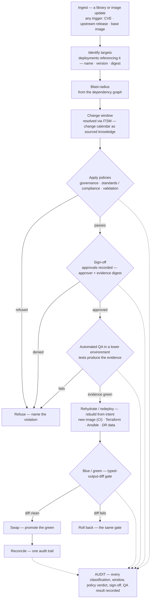

# Secure software supply chain — the orchestrated pipeline

**What this settles:** the end-to-end flow that carries a library or image update — from *any* trigger — to
a governed, evidenced blue/green deploy: **identify targets → blast-radius → change window → policies →
sign-off → lower-environment QA → rebuild → blue/green → reconcile**, every step audited. It is **the
rehydration pipeline entered through a supply-chain trigger** — so it **builds on
[request-realization](request-realization.md)** and **composes**
[change-control-adoption](change-control-adoption.md) (the ceremony), [uc-10](uc-10-dynamic-rehydration.md)
(the rebuild), and [application-tier-provisioning](application-tier-provisioning.md) (the admission gates),
adding only the ITSM-window, lower-env-QA, and blue/green stages.

> **Use Case:** `governance/secure-software-supply-chain`. **Persona:** platform-engineer · **Profile:** prod.

**In one breath.** A library or image update is ingested — the trigger doesn't matter (a CVE fix, an
upstream release, a base-image bump). The dependency graph returns the **targets** and the **blast-radius**;
the estate's change policy resolves a **change window** from the ITSM calendar; **governance, standards, and
validation policies** evaluate the change; required **sign-offs** are recorded; the change is rebuilt and
**QA'd in a lower environment** so its result is *evidence*, not a hope; then it's **rehydrated/redeployed**
— new image, Terraform, Ansible, DR data — behind a **blue/green typed-output-diff gate**, swapped only on a
clean diff, and reconciled. Every classification, window, policy verdict, sign-off, and QA result is on the
**audit chain**. Prod executes an already-validated path — it is not a test.

## The flow

## What this adds over rehydration / change-control
- **The trigger is a supply-chain ingest.** A library/image update enters as a classified change record —
  the same pipeline as rehydration, one door over. *What* changes is settled by ADR-045 (atomic
  recompilation, pins, visible debt); this flow is the calendar and ceremony around it.
- **Targets + blast-radius are derived.** The dependency graph returns the affected deployments (by
  name/version/digest), not a hand-kept list ([uc-07](uc-07-udlm-dependency-graph-data-model.md)).
- **The change window comes from the ITSM system.** The estate's change policy resolves the window from the
  **change calendar as sourced knowledge** (adopt-by-reference, ADR-053) — DCM integrates the ITSM, it does
  not replace it. Scheduling gates decide *when*; evidence gates decide *whether* — and no clause waives
  blue/green evidence for a breaking change.
- **QA in a lower environment is the evidence.** Automated tests run *before* prod, and their result is
  attached to the change (T6 pre-validated outcomes) — so the prod deploy executes an already-validated
  path.
- **Blue/green is the safety gate.** The new image promotes only on a clean typed-output diff (ADR-046); the
  swap is instantaneous and the rollback is the same gate.
- **One audit trail.** Classification, window, every policy verdict, sign-off, and QA result are
  tamper-evident records (uc-15 / uc-21).

## Success criteria (from the UC)
- The update is admitted trigger-agnostically and its **targets + blast-radius are derived** from the graph.
- The **change window** is resolved via the estate's ITSM integration, not invented.
- **Governance, standards, and validation** policies evaluate the change; refusals name the violation.
- Required **sign-offs** are recorded with approver + evidence digest.
- **Automated QA in a lower environment** produces evidence *before* any prod change.
- Promotion is behind a **blue/green typed-output-diff** gate; rollback uses the same gate.
- Every classification, decision, window, sign-off, and QA result is on the audit chain.

## Data · Policy · Provider
- **Data:** the classified change record (class + blast-radius), the target set, the resolved window, the
  sign-off records (approver + evidence digest), the QA evidence, and the typed-output diff.
- **Policy:** governance / standards / validation evaluation; the window and sign-off decisions; the
  blue/green promotion verdict.
- **Provider:** the CI/image build produces the new image; the automation platform (Terraform / Ansible)
  and the DR path rebuild and move data; the ITSM system sources the window; all report back for audit.

## Pointers
- Base flow: [request-realization](request-realization.md). Composes:
  [change-control-adoption](change-control-adoption.md) (ceremony), [uc-10](uc-10-dynamic-rehydration.md)
  (rebuild), [application-tier-provisioning](application-tier-provisioning.md) (admission gates). Related:
  [uc-07](uc-07-udlm-dependency-graph-data-model.md) (blast-radius),
  [uc-16](uc-16-policy-override-approval.md) (sign-off), ADR-045 (change class), ADR-046 (blue/green),
  ADR-053 (windows). UC source: `governance/secure-software-supply-chain`.
