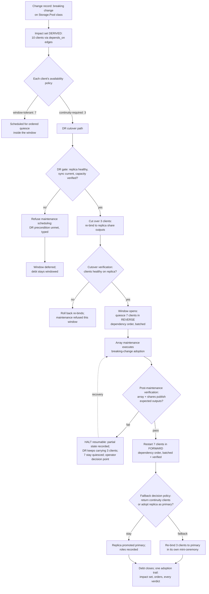

# Storage-array maintenance with dependent applications — the stage

**What this settles:** the full operational flow for disruptive maintenance on a shared
storage array that ten client applications depend on — the decisions, the policies that gate
each one, the DR preparation and cutover, the ordered quiesce and shutdown, and the recovery
paths when something fails mid-way. This is the change-control stage
([change-control-adoption](change-control-adoption.md) — policy decides the calendar, evidence
decides the outcome) composed with the dependency machinery the estate already has: the same
edges that derive shutdown order derive who must move, in what order, before the array may.

> **Use Cases:** `change-control/storage-array-maintenance-ordered`,
> `change-control/mid-maintenance-failure-dr-hold`, plus the family's window/ceremony cases.
> **Persona:** platform-engineer · **Profile:** prod.

**In one breath.** A breaking change must be adopted on a storage array whose file shares
serve ten applications; the impact set is *derived* from the dependency graph, not hand-listed;
each client's own availability policy sorts it into tolerate-the-window or needs-continuity;
the continuity clients are cut over to a verified DR replica first — a re-bind to the replica's
declared outputs, the same binding surface everything else uses — the window-tolerant clients
quiesce in reverse dependency order in batches; only then does the array take its maintenance,
inside the window, with every step verified; and if verification fails mid-way the flow halts
resumably with DR still carrying the continuity clients — the failure mode is a recorded,
recoverable state, never an outage discovered by users.

## The stage — what this composes (by contract)

- **The array:** a `Storage.Cluster` / `Storage.Pool` whose `Storage.FileShare`s are the
  producers ten applications bind to (`depends_on` edges; consumption via the shares'
  declared typed outputs — the [D8.3] binding surface).
- **The clients:** ten applications (`Compute.Container` / `Compute.VirtualMachine`
  workloads), each carrying its **own availability policy** — the per-client tolerance class
  (window-tolerant or continuity-required) is policy data, not an operator's recollection.
- **The replica:** a DR-paired array whose shares publish the *same typed outputs* — which is
  precisely what makes cutover a re-bind rather than a reconfiguration.
- **The order:** the estate's dependency edges, from which quiesce order (reverse), restart
  order (forward), and the impact set itself are derived — the shutdown-order machinery,
  reused unchanged.

## The sequence

Each phase's contract, in order:

1. **Impact derivation.** *Before:* the change record exists with its class-level blast
   radius. *After:* the estate-level impact set — the ten clients, their edges, their
   tolerance classes — is computed from the graph and attached to the plan. Nothing is
   hand-listed; a hand-list would already be wrong.
2. **DR gate.** *Before:* a plan requires continuity for three clients. *After:* maintenance
   may not even be *scheduled* until the replica is verified healthy, current, and sized —
   the fault-domain rule: never take the primary into maintenance while the failover target is
   unproven.
3. **Cutover.** *Before:* replica verified. *After:* the continuity clients consume the
   replica's share outputs; because binding is to declared typed outputs, cutover is a
   re-bind with verification, and rollback is the same operation in reverse.
4. **Ordered quiesce.** *Before:* cutover verified. *After:* window-tolerant clients are down
   in reverse dependency order, batch-verified — dependents before dependencies, always.
5. **Maintenance + verification.** *Before:* nothing user-facing depends on the primary.
   *After:* the adopted array publishes its expected declared outputs, proven before anything
   restarts.
6. **Ordered restart, failback decision, trail.** Forward order, batch-verified; then a
   *policy* (not a habit) decides failback vs. adopt-replica-as-primary; the trail records
   the derived orders and every gate verdict end to end.

## What informs each decision — model surfaces, validated 2026-07-25

The key validation item: every decision below names the exact UDLM surface that informs it,
resolved against the current registry here and now. Two decisions found real today-gaps —
filed as issues, not hand-waved. The **policy role** column separates policies that *decide*
(gate, refuse, select) from policies that *enrich* (supply data other steps read).

| Decision / step | Model surface read | Status | Policy role — decides or enriches what |
|---|---|---|---|
| Impact set (the ten clients) | realized-entity `dependencies[]` edges targeting the shares | **EXISTS** — validated: the estate's edge surface, same as shutdown order | Enriches: none needed — structure supplies the set; a policy may only widen review, never shrink the set |
| Tolerance split (7 window / 3 continuity) | each client's availability policy (a Policy object `match`ed to the client) | Policy object + match **EXIST**; the tolerance-class vocabulary **PENDING-ADR** | Enriches (`transformation`): stamps each client's class; then Decides which path each takes |
| DR gate (replica healthy, current, sized) | replica pool's declared outputs: `redundancy_status`, `degraded`, `fault_tolerance_remaining`, `spares_available` — **and the DR-pairing edge naming which pool is the replica** | Health outputs **EXIST** (Storage.Pool 0.3.x); the DR-pairing relationship **MISSING — issue #250** | Decides (`gating`): maintenance may not be scheduled until the gate passes |
| Cutover re-bind | replica shares' declared outputs (the [D8.3] binding surface) | Mechanism **EXISTS**; FileShare's surface is **THIN — `mount_uri` only, issue #251** (re-bind possible, share-side verification is not) | Decides (`validation`): cutover verified or rolled back |
| Client health post-cutover | client types' `run_state` / status outputs | **EXISTS** (VM/Container declared outputs) | Decides: proceed to window or roll back |
| Window + ceremony | change policy clauses (window, approval, expedite) | **PENDING-ADR** (temporal clause vocabulary — validated absent from policy schema) | Decides: when execution may occur and under what authority |
| Quiesce / restart order | the same `dependencies[]` edges, reverse and forward | **EXISTS** — derived, batched | Enriches: order derivation; Decides (`validation`) per batch verdict |
| Post-maintenance verification | array + share declared outputs vs expected | Pool outputs **EXIST**; share-side limited by #251 | Decides (`gating`): nothing restarts onto an unverified array |
| Failback decision | a declared failback policy (`policy_type: recovery`) | Policy type **EXISTS** in the vocabulary; the failback clause shape **PENDING-ADR** | Decides: return to primary vs promote replica; either outcome recorded |
| Trail | audit records | **EXISTS** | Enriches: one reconstructible history |

Summary of the validation: the flow's structural core — edges, orders, pool health outputs,
binding mechanics, client status, policy and audit machinery — **exists today**. Two
resource-type gaps are real and filed (#250 the DR-pairing edge, #251 FileShare's thin
outputs); the remaining pendings are the same change-control vocabulary the corpus family
demands, already the pending ADR's decision surface. UC 009's success criteria map onto this
table row-for-row — which is exactly what makes the use case analyzable: when the gaps close,
the analysis run flips, and the scoreboard shows it.

## The invariants

- **The impact set is derived, never asserted.** The same edges that derive shutdown order
  derive who is affected; ten clients is a graph query result.
- **Per-client tolerance is policy data.** The split into window-tolerant and
  continuity-required comes from each application's declared availability policy — the plan
  reads it, no one remembers it.
- **The DR gate precedes scheduling.** An unverified replica doesn't delay the maintenance —
  it *refuses* it, typed, with the debt staying visibly windowed.
- **Cutover is a re-bind on declared outputs.** No client reconfiguration, no
  provider-internal knowledge — which is also why thin output surfaces would make this flow
  impossible (output adequacy is a prerequisite, per ADR-046).
- **Quiesce reverse, restart forward, always batched, always verified.** Order is derived;
  verification gates each batch; failure halts resumably with DR still carrying the
  continuity clients.
- **Failback is a decision with a policy, not an afterthought.** Staying on the promoted
  replica is a legitimate outcome; either way the roles are recorded.

## What UDLM does not decide

How the quiesce/restart jobs execute (DCM Process-family orchestration), how replica sync is
implemented (provider-native), and how client health is probed (per-application). UDLM
supplies the graph, the typed outputs, the policies, the debt states, and the trail; DCM and
the providers execute against them.

## Data · Policy · Provider (required lens — SPEC-DESIGN §29)

- **Data:** the dependency graph and derived orders; the shares' declared outputs (the
  cutover surface); the impact set; the adoption trail with every verdict.
- **Policy:** the estate's change window and ceremony; each client's availability policy
  (tolerance class); the DR-gate precondition; the failback decision policy; the typed
  refusals (DR unmet, window violation).
- **Provider:** the array and replica providers publishing outputs; the Process-family jobs
  executing cutover, quiesce, maintenance, restart in derived order under the gates.

## Where each piece is specified

| Piece | Contract |
|---|---|
| Dependency edges → derived order | data-model-core §4 (edge model; ordering edge types) |
| Typed outputs as the binding/cutover surface | data-model-core §2 [D8.3]; ADR-046 (adequacy prerequisite) |
| Windows, ceremony, expedite, debt states | change-control family + walkthrough (ADR pending) |
| Evidence and promotion/refusal | ADR-046 |
| Corpus cases | `use-cases/change-control/009`, `/010` |
