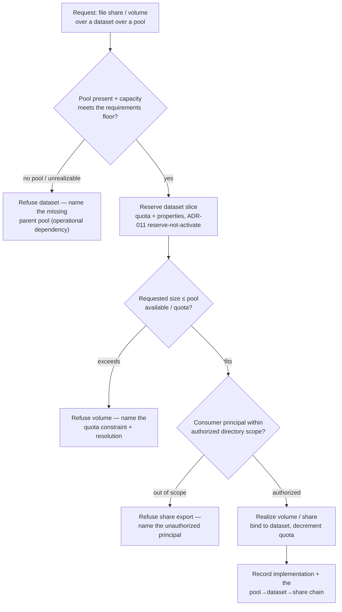

# Storage provisioning — pool → dataset → volume / share (the flow)

**What this settles:** how the storage family composes into one implementation — a **pool** yields capacity, a
**dataset** carves a bounded, policied slice of it, and a **volume** or **file share** exposes that slice to a
consumer. A **lighter** flow: it **builds on [request-realization](request-realization.md)** and
[uc-06-persistent-volume-provision](uc-06-persistent-volume-provision.md) (the single-volume case), and
documents only what the *chain* adds — the ordered dependency and its failure branches.

> **Use Cases:** `storage/provision-volume-bound-to-pool`, `storage/provision-dataset-with-quota-compression`,
> `storage/composite-fileshare-backed-by-pool-dataset` (positive); `storage/volume-request-exceeds-quota-refused`,
> `storage/dataset-parent-pool-missing-refused`, `storage/fileshare-export-to-unauthorized-principal-refused`
> (must-reject). **Persona:** platform-engineer · **Profiles:** dev / prod.

**In one breath.** A pool declares capacity as a requirements floor (tier, IOPS, throughput — never a native
class, ADR-036); a dataset reserves a bounded slice with a quota and properties, operationally dependent on its
pool; a volume or file share exposes that slice to an authorized consumer. The chain realizes bottom-up, each
link an **operational dependency** on the one below — a missing pool refuses the dataset, an over-quota request
refuses the volume, an out-of-scope principal refuses the share, each naming the root cause (ADR-052).

## The flow

## What the chain adds over the single-volume case

- **An ordered operational dependency** — share **depends_on** dataset **depends_on** pool; implementation is
  bottom-up and each link cascades its failure upward, naming the *root* (ADR-052), never a bare field.
- **Requirements-floor capacity, not a native tier** — the pool's tier is a named requirements bundle
  (min_iops / min_throughput), name-selectable but requirements-authoritative (ADR-036); portability is retained
  across providers that meet the floor.
- **Three distinct refusals, three roots** — missing parent (dataset), quota exceeded (volume), unauthorized
  principal (share). Each is a must-reject with a resolution, not a silent partial.

## What UDLM does not decide

Which provider backs the pool (ZFS, Ceph, an array), how it naturalizes a quota or an export into native form
(the naturalization boundary, DCM ADR-023), or the give-up bound on a transiently-unrealizable link (convergence
window is DCM policy, ADR-052). UDLM defines the resource shapes, the operational-dependency chain, the
requirements-floor capacity contract, and the surfacing contract; DCM's engine places, reserves, and realizes.

## Where each piece is specified

| Piece | Contract |
|---|---|
| Requirements-floor capacity (tier = named requirements, not native class) | ADR-036 |
| Operational dependency, root-cause surfacing, reserve-not-activate | ADR-052 / ADR-011 |
| The resource shapes + their examples | `registry/resource-types/storage/*` (`spec.examples`, ADR-055) |
| Corpus | `use-cases/storage/`, `use-cases/storage-redundancy/` |
