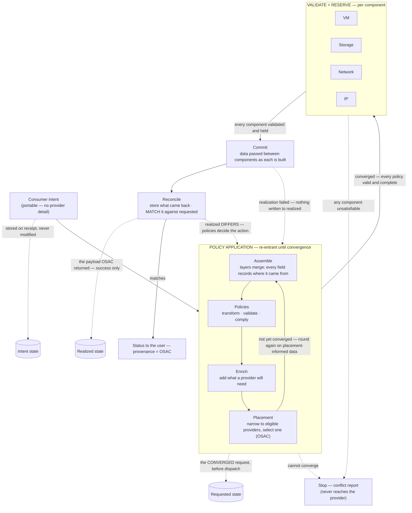
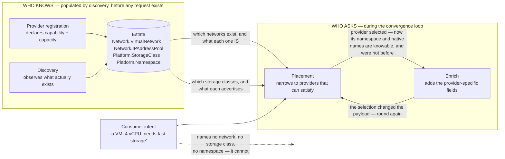

# UC-04 · Intent to VM placement on OSAC — the stage

**What this settles:** that an OSAC-backed provider is *just a provider* — DCM stays the governing control
plane, OSAC is chosen at placement and dispatched to like any other, and the realized record carries
provenance naming OSAC. A **lighter** flow — it **builds on [request-realization](request-realization.md)**
and documents only what this case adds.

> **Use Case:** `compute/vm-intent-osac-placement`. **Persona:** application-team-member · **Profile:** standard.

**In one breath.** A consumer submits a VM intent through the DCM API; validation policies run; the placement
engine selects the OSAC-backed provider; the request is dispatched to OSAC for implementation; and the `Realized`
state records provider provenance identifying OSAC — the whole intent-to-realized path auditable end to end.

## What this adds over request-realization
- **OSAC is a provider, not a dependency** — placement treats the OSAC-backed provider as one candidate among
  the eligible set. The base placement step is unchanged; what's proven here is that a specific provider
  *kind* participates through the ordinary contract.
- **Provider provenance is explicit** — the `Realized` record names OSAC as the realizing provider. Provenance
  is already part of the four-state model; this UC makes "which provider" a checked outcome.
- Everything after convergence — reserve, commit — is request-realization unchanged.

## The flow

The loop runs **assemble → validate → enrich → placement**, then round again — until every policy is
valid and complete. Layer assembly, transformation, validation and enrichment all happen *before*
placement; placement is the **last step of an iteration**, and what it chooses is data the earlier steps
have not seen. There is no separate post-placement phase: **the post-placement work is the next
iteration.** Only once it converges does each component validate and reserve, and only when every
component holds does anything commit.

**Why the loop matters.** A single forward pass cannot work: a policy that depends on *where* a resource
lands can only be satisfied once a placement exists, and satisfying it can invalidate the placement that
produced it. So the payload goes round again rather than through a separate post-placement stage. The
loop is bounded — the convergence limit is an engine parameter, and failure to converge is a full conflict
report, never a silent best-effort (see [ADR-006](../adr/ADR-006-convergence-control-model.md)).

**Why reserve is per component.** A VM request is not one thing. The VM, its storage, its network
attachment, and its IP are separate resources with separate providers and separate ways of failing.
Each is validated and held before *anything* is built, so a request that cannot be satisfied fails while
nothing has been created ([ADR-011](../adr/ADR-011-validate-and-reserve.md)).

---

## Where the data comes from

The loop above shows *when* each step runs. It does not show **where the facts come from**, and that
is the question a placement author actually has to answer. Raised in the 2026-08-10 engineering
review:

> *If OpenShift A reports five networks and OpenShift B another five, the person writing the
> placement needs to know **what each network does**. On "network A" I don't know anything.*

So: to place a VM on a KubeVirt-lineage provider you must know the **network**, the **storage class**
and the **namespace**. None of the three is in the consumer's intent — a portable intent cannot name
a provider's namespace — and none is invented by the loop. Each is **read from the estate**, and the
estate is populated by providers reporting what they have.

**The re-entrant loop is not a retry.** Placement cannot run until the estate has been read, and
enrichment cannot run until placement has chosen — because *which* namespace and *which* native
storage-class name apply are properties of the provider that was selected. Selecting changes the
payload, and the changed payload has to be re-validated. That is the loop, and it is why placement
sits inside it rather than after it.

### Worked: from "I need a network" to a reserved address

The concrete path the review asked for — network identified first, address reserved *before*
anything is built:

| # | Step | What is read | What is written |
|---|---|---|---|
| 1 | Consumer declares intent | — | a VM, its size, and a requirement — *"reachable from the office network"* |
| 2 | Placement reads the estate | every `Network.VirtualNetwork` a candidate provider reports | — |
| 3 | Placement selects | the network whose declared characteristics satisfy the requirement | the chosen network on the payload |
| 4 | Walk to the pool | `Network.IPAddressPool` `contained_by` that network | — |
| 5 | Reserve an address | the pool's free capacity | a held `Network.IPAddress` — **before the VM exists** |
| 6 | Enrich | the selected provider's Provider Class | namespace, native storage class, native subnet |
| 7 | Round again | the payload changed at 3–6 | re-validated against every policy |

Step 5 is why reserve is per component: the address is held while the VM is still hypothetical, so a
request that cannot get one fails before anything is created.

### What makes step 3 decidable

The consumer does not name a network. **They state what they need, and the loop converges on one** —
name-selectable but requirements-authoritative (ADR-036), the precedence `storage_tier` has followed
since 2026-07-27. Networks now follow it too.

**Three independent axes**, because they are three different questions, and a consumer may state
any, all, or none of them:

| Axis | The question | The provider reports | The consumer requires |
|---|---|---|---|
| **segment** | *which* logical network | `Network.VLAN`, via the `segment` edge | `networks[].vlan` |
| **zone** | *what kind* — DMZ, management, internal | `Network.zone` → a governed **taxonomy** term | `networks[].zone` |
| **tier** | *how good* — bandwidth, latency | `Network.tier` → a governed **floor** | `networks[].tier` |

A DMZ segment and an internal segment may perform identically, and two networks in the same zone may
not. One vocabulary would force an estate to choose which question it wanted the term to answer.

**`zone` and `tier` sit on the Network BASE**, not on a type — they are expected to be consumable by
every network provider, and scope IS portability (ADR-038 §3).

**A category is not a floor, which is why they are different artifacts.** `tier` is reference data
because a tier denotes something a second provider can measurably *meet*. `zone` is a **taxonomy**
because it is what a network *is* — and only a taxonomy carries `normalization_rules`, which is what
this needs: providers report `dmz-2`, `DMZ_RESTRICTED` and `dmz restricted`, and all three must land
on one canonical term before a policy can match on it.

**Zone is placement data, and nothing else** (maintainer ruling 2026-08-10). It is not an
authorization, not a control, and nothing critical hangs off it directly — **anything required
because of a zone is enforced by policy reading that zone**, never by the zone itself. That keeps
the model on the right side of its own boundary, and on the right side of zero-trust architecture,
which derives no trust from network location (NIST SP 800-207) — UDLM already ships a
`zero_trust.posture` setting that a location-as-trust reading would contradict.

**The segment axis survives leaving the datacenter.** `encapsulation` already carries
vlan / vxlan / geneve / flat, so the class is a segment of which 802.1Q is one form. A public cloud
exposes no VLAN — there the segment is a **VPC subnet**, adopted by reference (T5) rather than given
a parallel class: the VPC is the `Network.VirtualNetwork` and the subnet is the addressed segment
within it. The three clouds converged on that shape independently, so re-expressing it would invent
a fourth.

**`network_ref` is now optional.** Requiring it was the defect: it forced a consumer to name a
network they had no basis to choose between, which is exactly the objection above. Stating nothing
means policy decides. Stating a requirement means the loop must satisfy it. Naming a network that
fails a stated requirement is a **conflict**, not an override.

And a stated requirement is still only a request — the provider validates and reserves (ADR-011).
Nothing here lets a consumer assert past a provider that cannot deliver.

---

## Who provides what, and when — and what THIS case changes

The lifecycle answer — the personas, what a request contains, what is added and by whom, why nobody
sets placement, and the VM-with-network-and-storage example — lives once in
[request-realization § Who provides what, and when](request-realization.md#who-provides-what-and-when).
It holds for every use case; only the delta belongs here.

**What UC-04 changes:** one row of that table, and only its *value*.

| | Lifecycle answer | UC-04 |
|---|---|---|
| Who declares capability, capacity, residency | cloud-operator / provider-owner | **an OSAC cloud-operator** — the residency guarantee is real, not nominal |
| Provider-specific fields added at enrich | the selected provider's Provider Class | **OSAC's** — namespace, native storage class, native subnet |
| Which persona sets placement | nobody; it is derived | **unchanged** — OSAC is *selected*, never assigned |
| Reserved facts at reserve | from the component's provider | **unchanged** |

That last row is the point of the whole use case: a sovereign cloud participates through the ordinary
contract. If UC-04 needed a *different* answer to any of these questions, OSAC would not be "just a
provider" — and the claim this flow settles would be false.

## Success criteria (from the UC)
- Consumer submits the VM intent through the DCM API.
- Validation policies are evaluated **before** placement — and again after it, on the placement-informed payload.
- The placement engine selects the OSAC-backed service provider.
- The request is dispatched to OSAC for implementation.
- `Realized` state is recorded with provider provenance identifying OSAC.
- The provisioned VM is reachable and operational; the full intent-to-realized lifecycle is auditable.

## Data · Policy · Provider
- **Data:** the portable VM intent, the assembled payload with field-level provenance, and the `Realized`
  record carrying OSAC provenance.
- **Policy:** the whole convergence block — assemble, policy, placement, and enrichment are one re-entrant
  application, not a sequence with a gate in front of it.
- **Provider:** the OSAC-backed service provider declares capability and capacity, answers the reserve, and
  realizes the VM through the ordinary provider contract.

## Pointers
- Base flow: [request-realization](request-realization.md). UC source: `compute/vm-intent-osac-placement`.
- Authoritative assembly process (steps 1–9, exact policy phases):
  [`layering-and-versioning.md` §6](../spec/foundations/layering-and-versioning.md); the rendered
  placement loop is in the [annex](../spec/foundations/layering-and-versioning-annex.md).
