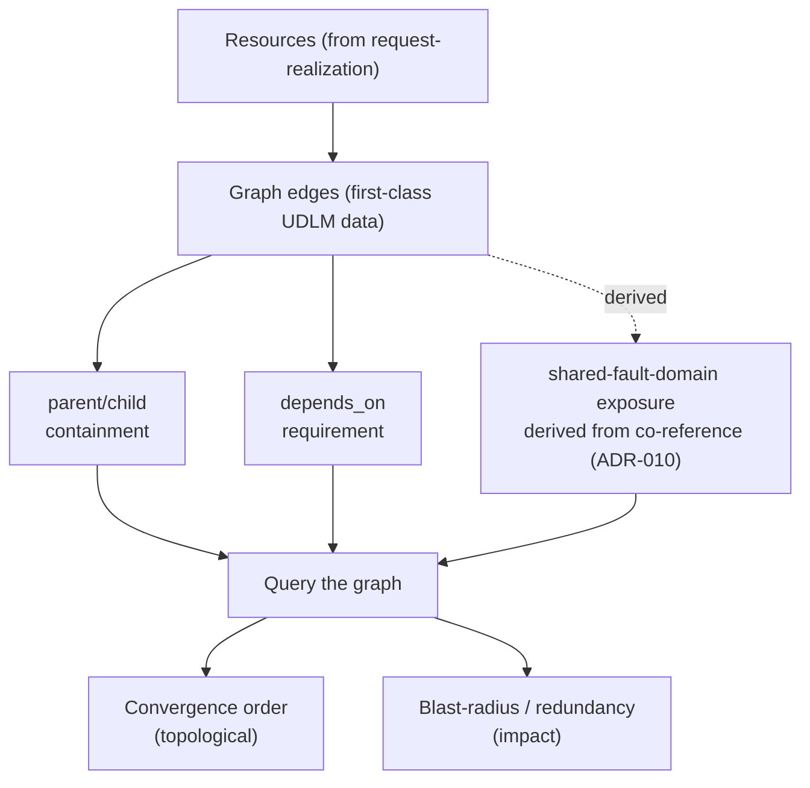

# UC-07 · Dependency graph as first-class data — the stage

**What this settles:** the dependency graph is *modeled data* in UDLM, not something DCM infers at runtime — the two ordering `edge_type`s (`contained_by` containment, `depends_on` requirement) plus the **derived** fault-domain projection (co-reference to org-ratified fault-domain anchors, ADR-010) that DCM can query for ordering and impact. A **lighter** flow — it **builds on [request-realization](request-realization.md)** and documents only what this case adds.

> **Use Case:** `dcm-core/standard/udlm-dependency-graph-data-model`. **Persona:** platform-operator · **Profile:** standard.

**In one breath.** request-realization builds one resource. Real estates are graphs of them. This case says the edges between resources are first-class, queryable UDLM data — **parent/child containment** (`contained_by`) and **`depends_on` requirement** — with **shared-fault-domain exposure derived** from co-reference to fault-domain anchors (ADR-010), never authored as an edge. Because the graph is data, DCM *derives* safe ordering and blast-radius from it — the ordering isn't bolted on after the fact.

## What this adds over request-realization

- **Edges are typed data, not runtime guesses.** Two ordering `edge_type`s, each with defined meaning: containment (`contained_by`, parent/child) and requirement (`depends_on`); shared-fault-domain (co-located risk) is **derived** from co-reference to fault-domain anchors (ADR-010), not a third authored edge.
- **The graph is queryable two ways** — for **convergence order** (topological over `depends_on` + containment) and for **blast-radius / redundancy** (what falls with this node, and what survives).
- **Ordering is derived, not decorated.** DCM reads order and impact *from* the graph ([the fault-domain lens, SPEC-DESIGN §29 triad](request-realization.md#data--policy--provider-required-lens--spec-design-29)) — nothing computes a separate ordering table.

## The flow — only what's different

Each node is realized by request-realization; this UC is the edges between them.

## Success criteria (from the UC)

- UDLM defines the ordering `edge_type`s — `contained_by` containment and `depends_on` requirement — and derives shared-fault-domain exposure from co-reference (ADR-010).
- The graph is queryable for convergence order and blast-radius / redundancy impact.
- DCM derives safe operation ordering and redundancy impact directly from the UDLM graph — it is not bolted on.

## Data · Policy · Provider

- **Data:** the ordering `edge_type`s as first-class UDLM structure (edges carry endpoints and `edge_type`); fault-domain anchors as referenced data (ADR-010).
- **Policy:** cross-domain constraint (`cross_domain_constraint`) — ordering/impact policies query the graph rather than owning their own dependency map.
- **Provider:** contributes containment and fault-domain facts it knows (e.g. which host a VM lands on).

## Pointers

- Base flow: [request-realization](request-realization.md). UC source: `dcm-core/standard/udlm-dependency-graph-data-model`.
- Built on by cross-provider ordering (UC-08) and failure impact (UC-09).
