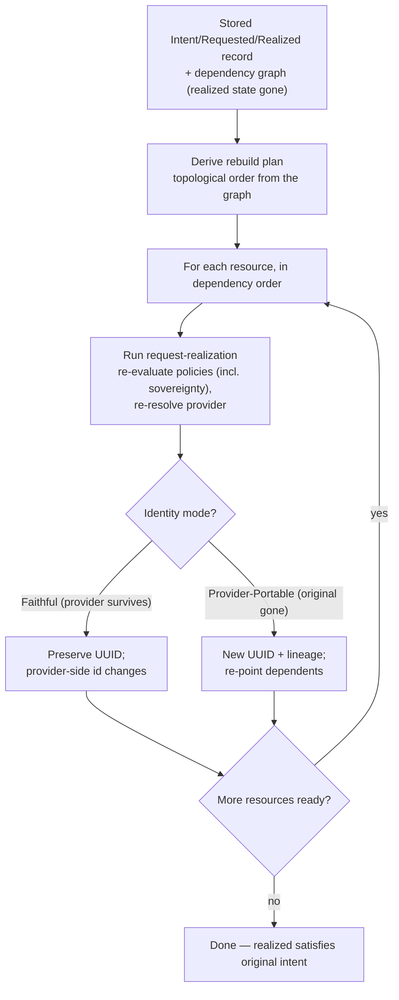

# UC-10 · Rehydration — rebuild from stored intent (the stage)

**What this settles:** how an environment is re-realized from **stored intent** after loss — the plan
*derived* from the dependency graph, policies re-evaluated, providers re-chosen as if fresh. This is the
UDLM-stage view of the same operation the DCM how-to `workload-migration-and-rehydration-example` walks
end-to-end (in the DCM repo). A **lighter** flow: it **builds on
[request-realization](request-realization.md)** and documents only what rehydration adds.

> **Use Case:** `cross-domain/dynamic-rehydration`. **Persona:** platform-engineer · **Profile:** standard.

**Three words, one act.** *Rehydration* is the **operation** — replay a stored Intent / Requested / Realized
record against a target. *Rebuild* is its **mechanism** — the target stands up a fresh, native implementation
from that intent, never a lift-and-shift of the source construct (the technically correct word). *Migration*
is the **effect** the user sees — the workload now runs on a new provider. **Migration and rehydration are
the same operation with different triggers:** a planned move (migration) vs a loss / DR event (rehydration).
The pivot is **intent** — neither translates a source construct into a target one; both ask what the workload
*needs* and let each provider satisfy it natively. So there is no NSX→OVN conversion to fail: only the
requirement (`isolation: private`) is carried across, and the target realizes it its own way.

**In one breath.** Everything realized is gone; the stored intent and the dependency graph survive. The
system reads that graph, derives a rebuild order on the spot, and runs request-realization for each resource
in dependency order — re-evaluating validation policies (sovereignty included) and re-resolving providers as
it goes. When it finishes, the realized state satisfies the original intent.

**Identity — by mode (`RHY-005`, four-states §5.2).** The mode is set by what survives:
- **Faithful (restore in place)** — the original's provider is still available; the entity **UUID is
  preserved**, only the provider-side identifier changes (recorded in `provider_entity_id_history`).
- **Provider-Portable (rebuild — the original is gone)** — a **new entity with a new UUID**, kept **traceable
  to its predecessor by lineage** (`source_store` / `source_record_uuid`); dependents are **re-pointed** to
  the new UUIDs as the dependency graph replays. It is the *same logical graph* re-established, not the same
  identifiers.

Total-loss rehydration — this flow's scenario — is **Provider-Portable**: new UUIDs, lineage-traced,
dependents re-pointed. (A restore while the provider still stands is the Faithful mode instead.) Rehydration
is transactional either way — a failed target leaves the pre-rehydration state intact.

## What this adds over request-realization
- **Many implementations, ordered by the graph** — request-realization run once per resource, sequenced by the
  stored dependency graph so dependencies come up before dependents. The per-resource flow is unchanged.
- **The plan is derived, not replayed** — there is no recorded action log to re-run; the order is computed
  from the graph at rebuild time, so a changed policy or a departed provider is honored automatically.
- **Policies re-evaluate per the estate's touch-trigger stance** (ADR-045 §8) — under the common
  adopt-current default, sovereignty and the other validation policies run again, and a resource can
  legitimately land on a different provider than it did originally. `RHY-001`'s floor (tenancy, sovereignty,
  cross-tenant authorization always **current**) applies under every stance; a pinned estate replays against
  its pinned revisions.
- **Identity by mode, lineage always** — preserved on a Faithful restore, new-but-lineage-traced on a
  Provider-Portable rebuild (`RHY-005`). Either way the predecessor is resolvable from provenance, and the
  data model needs no separate rehydration-history structure.
- **Completeness is the bar** — done when every resource in the original intent is realized and the realized
  state satisfies intent, not when a sequence "finished".

## The flow — only what's different

Everything inside each rebuild step is request-realization.

## Success criteria (from the UC)
- All resources are destroyed (realized state cleared) before rebuild.
- The system derives a rebuild plan from stored intent and the dependency graph.
- The plan is computed dynamically, not replayed from a recorded sequence.
- Validation policies (including sovereignty) are re-evaluated; `RHY-001`'s floor stays current.
- Providers are resolved via the standard placement engine.
- All resources are re-realized in the correct dependency order.
- Identity follows the `RHY-005` mode: preserved on a Faithful restore, or a new UUID kept traceable by
  lineage with dependents re-pointed on a Provider-Portable rebuild.
- Post-rebuild realized state satisfies the original intent.

## Data · Policy · Provider
- **Data:** the stored Intent / Requested / Realized record + the dependency graph are the sole source of
  truth; identity resolves per the `RHY-005` mode, with lineage (`source_store` / `source_record_uuid`) on a
  rebuild.
- **Policy:** validation policies (sovereignty included) re-evaluate per the estate's declared touch-trigger
  stance (ADR-045 §8) — adopt-current is the common default, not a platform imposition; `RHY-001` is always
  current.
- **Provider:** the placement engine re-resolves each resource; on a migration / Provider-Portable rebuild a
  data-migration provider repopulates the data. DCM orchestrates the replay (placement re-evaluation, leases,
  the `PENDING_REVIEW` pause); UDLM contributes the stored record, the derived order, and the `RHY` invariants.

## Pointers
- Base flow: [request-realization](request-realization.md). Measured and validated by
  [UC-12](uc-12-rehydration-rto-measurement.md). End-to-end implementation walkthrough: the DCM how-to
  `workload-migration-and-rehydration-example`. UC source: `cross-domain/dynamic-rehydration`.
