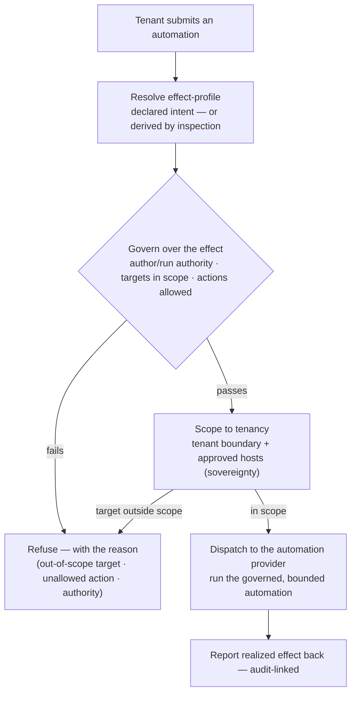

# UC-22 · Governed automation — the stage

**What this settles:** how an automation is governed by **what it does** — its declared or inspected
**effect** — not merely by who may run the artifact: the automation's effect is resolved into a profile,
policy is evaluated **over that effect**, and the whole thing is scoped to a tenant boundary, all **before**
it is dispatched. A **lighter** flow — it **builds on [request-realization](request-realization.md)** and
documents only what this case adds.

> **Use Case:** `governance/governed-automation`. **Persona:** platform-engineer · **Profile:** prod.

**In one breath.** A tenant submits an automation to run. Before anything dispatches, its **effect-profile**
is resolved — the resources it targets and the actions it takes, from its *declared* intent or *derived by
inspection* when undeclared. Policy is evaluated against that profile: who may author it, who may run this
specific automation, whether its targets are in scope, what actions it may take. Sovereignty scopes it to the
tenant's estate and the approved hosts. Only an automation whose **effect** clears governance is dispatched —
and a target outside scope is refused **structurally**, whatever the automation's code says.

## What this adds over request-realization
- **The governed subject is the *effect*, not the artifact.** An automation is a Process whose realization
  touches other resources; what governance evaluates is its **effect-profile** (targets · actions ·
  blast-radius), never just the playbook/workflow wrapper or the credential.
- **Inspect → govern → tenancy, in that order.** (1) Resolve the effect-profile — from the automation's
  *declared* intent, or *derived by content inspection* when it is undeclared. (2) Evaluate policy over the
  profile. (3) Scope to the tenant boundary. You cannot govern what you have not inspected, and tenancy is
  governance scoped to a boundary.
- **Effect is bounded structurally.** Policy bounds the **targets**; sovereignty gates the **hosts**
  (approved-list, [ADR-057](../adr/ADR-057-sovereignty-placement-and-provenance.md)); the **information
  firewall** bounds cross-boundary reach ([ADR-041](../adr/ADR-041-policy-information-firewall.md)); the
  **dependency graph** yields blast-radius *before* the run. A target outside scope is refused — regardless
  of the code.
- **Author ≠ executor; who × which-specific automation.** Authoring and execution are separate authorities
  (separation of duties); a grant is to a **specific** automation capability, not a class-wide "may run
  automation" — delegation is set-contained (UC-19/UC-20).
- **UDLM carries; DCM decides.** UDLM carries the effect-profile, the policy inputs, and the scope **as
  data**, and records the verdict; DCM evaluates, decides, and dispatches; the inspection that derives an
  *undeclared* effect is a policy/provider capability DCM applies. UDLM does not run automation or enforce.

## The flow — only what's different

Everything inside dispatch is request-realization; the automation provider is the realizer.

## Success criteria (from the UC)
- An automation's **effect-profile** is resolved (declared or inspected) **before** dispatch.
- Policy is evaluated over the **effect** — targets and actions — not just the artifact or credential.
- A target outside the tenant's scope, or off the approved-host list, is refused **structurally**.
- **Authoring and execution are separate authorities**; a grant is to a specific automation, not a class.
- The dispatch verdict **and** the effect-profile are recorded on the audit chain.

## Data · Policy · Provider
- **Data:** the automation Process, its **effect-profile** (targets · actions), the tenant/sovereignty scope,
  and the audit record of the verdict.
- **Policy:** evaluates authoring/execution authority, target-in-scope, and action-allowed over the profile;
  deriving an *undeclared* effect by inspection, and categorizing it, is a policy/analysis step DCM applies.
- **Provider:** the automation platform is the **realizer** — it runs only the governed, in-scope automation
  and reports the realized effect back for reconciliation.

## Pointers
- Base flow: [request-realization](request-realization.md). Related: [ADR-041](../adr/ADR-041-policy-information-firewall.md)
  (information firewall), [ADR-057](../adr/ADR-057-sovereignty-placement-and-provenance.md) (sovereignty /
  approved-host), [uc-16](uc-16-policy-override-approval.md) (approval / SoD),
  [uc-19](uc-19-policy-resolution-capability.md) / [uc-20](uc-20-profile-resolution-capability.md)
  (profile-closed policy, set-containment). UC source: `governance/governed-automation`.
