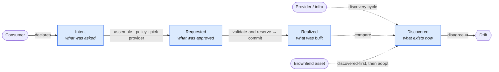

# UDLM — The Four States


**Document Status:** ✅ Complete
**Related Documents:** [Context and Purpose](context-and-purpose.md) | [Entity Relationships](../entities/entity-relationships.md) | [data stores](../contracts/storage-providers.md) | [Audit, Provenance, and Observability](../observability/audit-provenance-observability.md)

> **Foundation Document Reference**
>
> This document is a detailed reference for a specific domain of the UDLM data model.
> The three foundational abstractions — Data, Provider, and Policy — are defined in
> [foundations.md](foundations.md). All concepts in this document map to one or
> more of those three abstractions.
> See also: [Provider Contract](../contracts/provider-contract.md) | [Policy Contract](../contracts/policy-contract.md)
>
> **This document maps to: DATA**
>
> The Data abstraction — four lifecycle stages and their storage models


---

## In one breath (start here)

An entity's life is tracked as **four parallel records — not four sequential stages.** Each answers a
different question, and they coexist:

- **Intent** — *what the consumer asked for* (immutable, the raw declaration).
- **Requested** — *what was approved and dispatched* to a provider (assembled + policy-processed + provider chosen).
- **Realized** — *what the provider actually built* (provider-confirmed, with the real IPs/IDs it added).
- **Discovered** — *what is observed to exist right now* (ground truth, refreshed each discovery cycle).

All four share **one Entity UUID** (§3), so the whole story links. **Drift** is simply *Realized and Discovered
disagreeing* (§6). An entity may enter **intent-first** (declare → build) or **discovered-first** (a racked
server inventoried, then adopted) — same UUID either way.



The rest of this document is the detailed contract for each record; §2.6 traces one concrete entity through all four.

---

## 1. Purpose

The four states are the foundational model for how UDLM tracks the complete lifecycle of any resource or service. Every entity exists in one or more of these states simultaneously. The states are not sequential stages — they are parallel, independently maintained records that together provide a complete, auditable picture of what was requested, what was approved, what was built, and what actually exists.

The four states answer four distinct questions:

| State | Question Answered | Data Domain |
|-------|------------------|-------------|
| **Intent State** | What did the consumer ask for? | Commit Log (intent) — append-only, immutable |
| **Requested State** | What was approved and dispatched to the provider? | State Store (requested) — append-only, immutable |
| **Realized State** | What did the provider actually build? | State Store (realized) — versioned snapshots, `is_current` flag |
| **Discovered State** | What is observed actually existing right now? | Discovered stream — ephemeral, refreshed per discovery run |

> **Store note:** Stores are defined by CONTRACT, not technology ([data-model-core](data-model-core.md) §6, ruling D1). The four states bind to conforming stores per profile and sovereignty/tenancy policy — a single PostgreSQL-compatible database at `standard`/`prod` (the reference implementation), git as a conforming carrier at `homelab`, and per-tenant/zone store instances, WORM audit tiers, or accredited substitutes at `fsi`/`sovereign`. The concrete storage mechanics are implementation architecture (see the DCM architecture documentation).

---

## 2. State Definitions

### 2.1 Intent State

The **Intent State** is the immutable record of a consumer's original declaration. It is captured at the moment a request is submitted — before any layer assembly, before any policy evaluation, before any provider selection.

**Characteristics:**
- Immutable once created — the consumer's original intent is never modified
- Stored in a profile-bound Commit Log per the [D1] contract — append-only, versioned, tenant-isolated; git is the conforming carrier at `homelab` and the PR-based ingress at `standard`/`prod`
- Fully versioned — every revision of an intent is traceable
- The entity UUID is assigned at Intent State creation — it follows the entity through all subsequent states

**When created:** Every request submission, every rehydration operation, every drift remediation authorization

**Content:** The consumer's raw declaration in UDLM format — what they want, not what will be built

### 2.2 Requested State

The **Requested State** is the fully assembled, policy-processed, provider-ready payload. It is produced from the Intent State by request assembly — after layer assembly, after all policy evaluation, after provider selection.

**Characteristics:**
- Immutable once created — a new Requested State is created for each request cycle
- Stored in a profile-bound State Store per the [D1] contract — committed, versioned
- Contains the complete assembled payload with full field-level provenance
- Contains the results of all policy evaluations — which policies ran, what they did, what they locked
- Contains provider selection — which provider will realize this request
- Is the authoritative record of what was instructed to be built

**When created:** After Intent State approval, after successful policy processing

**Content:** The complete assembled payload in UDLM format, with full provenance chain, policy evaluation results, provider selection, and override control metadata

### 2.3 Realized State

The **Realized State** is the provider-confirmed record of what was actually built. It is the denaturalized result of the provider's execution, translated back to UDLM format.

**Characteristics:**
- Write-once complete snapshots — each Realized State record is a full entity state, never modified after writing
- Every Realized State record is traceable to exactly one Requested State record — no exceptions
- Contains provider-specific details not in the Requested State — assigned IPs, generated passwords, actual storage sizes, provider-internal IDs
- Is the authoritative record of what actually exists
- Drift is detected by comparing the most recent Realized State snapshot against Discovered State
- Carries a supersession chain — each snapshot knows which snapshot it superseded and which superseded it

**Three write sources (all require a corresponding Requested State record):**

| Source | Requested State record type | Example |
|--------|---------------------------|---------|
| Initial implementation | `initial_implementation` | Consumer provisions a new VM |
| Consumer update request | `consumer_update` | Consumer patches an editable field |
| Provider update notification | `provider_update` | Provider reports an authorized state change (auto-healing, maintenance) |

**What does NOT write to the Realized store:**
- Drift detection — drift only compares, never writes
- Discovery cycles — discovery writes to the Discovered stream only
- Unsanctioned provider changes — these are drift events until evaluated and explicitly approved

**When created:** When a provider confirms implementation of any authorized request (initial, consumer update, or approved provider update notification)

**Content:** Complete entity state snapshot in UDLM format, with provider-added fields, full field-level provenance including provider attribution, and supersession chain references

### 2.3a Implementation is two-phase — validate-and-reserve, then commit

The transition from Requested State to Realized State is **not a single dispatch** — it is **two-phase:
validate-and-reserve, then commit** ([ADR-011](../docs/adr/ADR-011-validate-and-reserve.md)). What the data
model fixes is **the guarantee and the artifacts, not the procedure**: nothing is built until the whole
request is validated and reserved. *How* an implementation gets there is DCM runtime (below).

**The contract (data model):**
- **A reservation is a first-class, TTL'd artifact.** A reserve validates the request against a provider's
  capacity/identity/policy and **holds** the result, yielding a **`reservation_hold_uuid`** plus the
  provider's **computed realize-time facts** (a reserved placement's port, a reserved address) — recorded
  in the Requested-state resolution (`reservation_hold_uuid` in `placement.yaml`,
  `entities/service-dependencies.md` §11), so the whole reserved graph is **auditable before commit**. A
  reserve **builds nothing** and writes **no** Realized State.
- **Reserved facts feed dependents.** A dependency whose criteria derive from a parent's realize-time state
  (`fulfillment: provider`, ADR-009) is satisfiable from the parent's *reserved* facts — nothing is built
  to resolve the graph.
- **Commit is all-or-nothing at a barrier.** Nothing commits until **every** reservation in the effective
  graph is held-and-valid **and** all applicable policy (placement, governance-matrix, cycle, quota) is
  green against the **fully reserved** graph. Commit is the only phase that mutates infrastructure and
  writes Realized State (§2.3).
- **Release is a hold-drop, not a teardown.** Any held reservation not committed is released — on
  validation failure, cancellation, or hold-TTL expiry — and because reserve built nothing, there is no
  orphaned resource to compensate.
- **No sixth lifecycle state.** `lifecycle_state` stays on its five canonical values; an active hold is a
  `RESERVATION_HELD` **`status.conditions`** overlay (§2.5), not a state.

**The mechanism (implementation / DCM).** *How* an implementation reaches a consistent set of holds — the
reserve→recompute-dependents **reconciliation loop**, its multi-round negotiation and iteration to a fixed
point, the re-entrant convergence it runs inside, and its terminal conditions
(`RESERVE_QUERY_ALL_EXHAUSTED`, `RESERVATION_RECONCILE_STALEMATE`) — is implementation architecture, specified
by ADR-011 / [ADR-006](../docs/adr/ADR-006-convergence-control-model.md) and the DCM docs, not by this data
model. A peer that upholds the guarantee and the artifacts above conforms, however it converges. Policies
that opt into that loop (`reconciliation.participates`, policy-contract §7.6) re-evaluate as reserved facts
land; others evaluate once at the commit barrier.

### 2.4 Discovered State

The **Discovered State** is what is observed actually existing through active discovery — polling providers, querying infrastructure APIs, interrogating resources. It is the ground truth of what physically exists, independent of what the model believes exists.

**Characteristics:**
- Append-only snapshot stream — each discovery cycle produces a new snapshot
- Ephemeral — recent history retained, older snapshots archived or discarded
- High-frequency and machine-generated — not appropriate for human review
- Consumed by drift detection (comparing against Realized State) — one of the two roles of the dual-role model below
- May contain resources that were never provisioned — brownfield resources discovered for ingestion

**When created:** On every discovery cycle, on demand for specific entities

**Content:** Raw discovered resource state in UDLM format, with discovery metadata (timestamp, discovery method, provider interrogated)

**Raw / unallocated resources (discovered-first entry).** A resource MAY exist with **only** its Discovered State populated and **no Intent** — a freshly racked server, a spare drive, any brownfield asset that physically exists but has not been allocated. This is the **discovered-first** lifecycle entry, the peer of intent-first (declare → realize): the estate ingests the raw resource purely for **inventory and tracking**, carrying `lifecycle_state: available` (unallocated). The resource is later **adopted** — an Intent is attached (allocation / brownfield ingestion), moving it into the managed lifecycle — and adoption **preserves the Entity UUID** (§3), so all inventory history accrues to the same entity.

**Discovered has a dual role (dcm ADR-017 Decision A, #222).** Discovered is (1) the **ephemeral per-cycle snapshot stream** consumed by drift detection, *and* (2) a **durable, per-UUID entity inventory** — the source of truth for *what exists*, including discovered-but-**unclaimed** resources (no provider attached). These are one domain, not two stores: the durable inventory record is the latest reconciled observation per entity; the snapshot stream is its history. The durable-inventory role is exempt from snapshot-stream retention ceilings; the reconciled inventory record persists until claim or retirement ([data-model-core](data-model-core.md) §3). **Unclaimed = inventoried, not managed** (queryable, excluded from lifecycle operations); a provider claim/adoption moves the entity Discovered → Realized preserving its UUID, and a long-lived unclaimed resource is surfaced as visible inventory debt — its age is the signal; claiming or retiring it is the estate's decision (advisory best practice, never an imperative). Multiple discovery sources correlate to ONE entity via `correlation_ids` (realized-entity.schema.json; every discovery source MUST emit them). See [SPEC-DESIGN-REQUIREMENTS](../registry/SPEC-DESIGN-REQUIREMENTS.md) §28 and the canonical `lifecycle_state` element (`registry/common-elements.md` §6).

### 2.5 Recovery Conditions — a `status.conditions` overlay, NOT lifecycle states

**Recovery and health are `status.conditions`, not lifecycle states** ([data-model-core](data-model-core.md) §3): `lifecycle_state` never leaves its five canonical values (`Intent → Requested → Realized ↔ Discovered` + `Decommissioned`). When the normal provisioning lifecycle encounters timeouts, cancellation failures, or partial realization on an Resource, the situation is expressed as a **condition type** on the entity's `status.conditions` (realized-entity.schema.json `status`) — an overlay on whatever lifecycle state the entity is in. Conditions are governed by Recovery Policies.

| Condition type | Meaning | Entry Trigger |
|----------------|---------|--------------|
| `TIMEOUT_PENDING` | Dispatch timeout fired; cancellation sent to provider | `DISPATCH_TIMEOUT` recovery trigger |
| `LATE_REALIZATION_PENDING` | Provider responded after timeout; NOTIFY_AND_WAIT active | `LATE_RESPONSE_RECEIVED` recovery trigger |
| `INDETERMINATE_REALIZATION` | State ambiguous; drift detection resolving | `DRIFT_RECONCILE` recovery action |
| `COMPENSATION_IN_PROGRESS` | Compound service rollback underway | `PARTIAL_REALIZATION` trigger |
| `COMPENSATION_FAILED` | Rollback itself failed; orphaned resources possible | Compensation step failure |

The complete recovery-condition machine and Recovery Policy model — how an implementation drives these conditions — is implementation concern; see the DCM operational model. (Earlier revisions called these "five additional states" — superseded; they never extend the lifecycle enum.)

---

## 2.6 A worked example — one VM through the four states

To make the records concrete, here is a single `Compute.VirtualMachine` (entity UUID `…a1b2`) as it moves
through the lifecycle. Each state is a **separate, immutable record**; the shared UUID links them. Field
values are illustrative — the normative shapes are the resource-type spec + `realized-entity.schema.json`.

| State | The record (illustrative) | Who wrote it |
|-------|---------------------------|--------------|
| **Intent** | `{entity_uuid: …a1b2, resource_type: Compute.VirtualMachine, cpu: 4, memory: 16GiB, network: "app-tier"}` — the consumer's raw ask, nothing added. | consumer (PR / API ingress) |
| **Requested** | the Intent, **assembled**: org-default image + tags layered in, policy results recorded (sovereignty zone resolved, quota green), **provider selected** (`kubevirt-prod`), and a `reservation_hold_uuid` from validate-and-reserve. **Nothing is built yet.** | assembly + policy (DCM) |
| **Realized** | provider-confirmed **after commit** — everything above **plus the provider's facts**: `ip: 198.51.100.20`, `vm_id: kv-9f3c`, actual disk `20GiB`. A write-once snapshot, traceable to exactly one Requested record. | provider → denaturalized to UDLM |
| **Discovered** | a later discovery cycle observes the VM running at `198.51.100.20`, correlated to `…a1b2` via `correlation_ids`. It **matches** Realized → **no drift**. | discovery |

**The point the example makes:**
- Each state is a *different question about the same entity*, held as its own record — not one object mutated in place.
- The transition Requested → Realized is where **two-phase reserve/commit** (§2.3a) sits: the `reservation_hold_uuid` proves the whole graph was reservable *before* anything was built.
- If a later discovery saw `ip: 203.0.113.9` while Realized still said `198.51.100.20`, that mismatch **is drift** (§6) — Discovered never overwrites Realized; it only compares.
- Had this VM been a pre-existing server instead, it would enter **Discovered-first** (§2.4) with `lifecycle_state: available`, then gain an Intent on adoption — same UUID, story running the other direction.

---

## 3. The Entity UUID — Universal Linking Key

Every entity has a single UUID assigned at Intent State creation. This UUID is the universal key linking the entity across all four states and all stores:

```
Commit Log (intent):     records keyed by entity_uuid
State Store (requested):  records keyed by entity_uuid
State Store (realized):   snapshot stream keyed by entity_uuid
Discovered stream:        snapshot stream keyed by entity_uuid (matched via provider labels)
Audit Store:              all provenance events indexed by entity_uuid
```

Given an entity UUID, the complete history of that entity can be reconstructed across its entire lifecycle — from the consumer's original intent through every state transition to the current discovered state.

---

## 4. The Data Domain Model

All four states are distinct data domains, each with specific immutability rules and access patterns. These immutability contracts are part of the data model; any conforming store binding MUST satisfy them (the concrete enforcement mechanism is implementation architecture — see the DCM architecture documentation for the reference PostgreSQL implementation).

| Domain | Immutability contract |
|--------|----------------------|
| **Intent** | Append-only — a new intent creates a new record; previous intents are never modified. Tenant-isolated. |
| **Requested** | Append-only — each policy evaluation produces a new version with full provenance. Tenant-isolated. |
| **Realized** | Versioned snapshots — each state change creates a new record; exactly one is current per entity. Tenant-isolated. |
| **Discovered** | Ephemeral snapshot stream — each discovery run produces fresh snapshots; grouped per discovery run. Tenant-isolated. |

**Audit records** are stored as leaves of an **RFC 9162 (Certificate Transparency v2.0) Merkle tree** — per-leaf signatures, signed tree heads, O(log n) inclusion and consistency proofs (ruling D2; see [universal-audit](../observability/universal-audit.md) `AUD-006`) — append-only with per-entity chain sequence numbers. The Merkle audit model is the data-model audit contract; its storage binding is implementation architecture.

**The Realized snapshot model — snapshots, not deltas.** The Realized domain uses a **snapshot model**: each record is a complete entity state, not a delta. This makes rehydration a direct lookup rather than an event replay, and makes point-in-time queries ("what was the state on March 15?") direct lookups. The authoritative snapshot shape is [`realized-entity.schema.json`](../registry/realized-entity.schema.json) (`realized_uuid`, `entity_uuid`, `source_type` + `request_uuid` — mandatory, never nullable — versioning, `is_current`, complete `fields`, and `provider_metadata`).

---

## 5. Rehydration

Rehydration is using a previously stored state record as the starting point for a new request — for DR, cloning, environment refresh, or replacing a failed resource. It is **not** a shortcut around governance: the estate's declared touch-trigger stance (ADR-045 §8 — adopt-on-touch, offer-on-touch, or provenance-until-explicit, declared once as a policy clause) decides which policy revisions govern the replay, with adopt-current the common default; RHY-001's floor (§5.3 — tenancy, sovereignty, cross-tenant authorization always current) applies under every stance.

**Rehydration adds almost nothing to the data model.** It is an *operation over data UDLM already carries* — replay a stored **Intent / Requested / Realized** record through the **dependency graph** (which supplies the correct order). The entity's identity is preserved on a **restore in place** and re-established on a **rebuild** (§5.2). UDLM contributes only the three irreducible things below; *how* an implementation runs the replay — placement re-evaluation, policy-version pinning, leases, concurrency, the tenancy-conflict pause — is implementation concern (see the DCM operational model, `operations/rehydration.md`).

### 5.1 Sources — the three stored states

A rehydration starts from any of the three stored states; this is not new structure, just the four-state model read backwards:

| Source | What is replayed | Typical use |
|--------|------------------|-------------|
| **Intent** | the raw declaration, through current layers | upgrade to current standards, environment refresh |
| **Requested** | the assembled, policy-processed payload | reproduce close to the approved spec |
| **Realized** | the provider-confirmed state (provider-specific fields stripped) | exact DR / clone / replace a failed resource |

### 5.2 Preserved identity + lineage

Identity behaves in one of two ways, by scenario — mirroring the rehydration **modes** (§5.3):

- **Restore in place** (the *Faithful* mode — the same resource returns on its provider). The entity **UUID is preserved**; only the **provider-side identifier** changes (recorded in `provider_entity_id_history`, `REHYDRATE` audit action). Every external reference (CMDB, cost attribution, audit, relationships, dependency declarations) is by UUID, so preserving it keeps them valid.
- **Rebuild from intent** (the *Provider-Portable* mode — the original is gone, e.g. its provider is offline, so the workload is re-realized elsewhere). The replacement is a **new entity with a new UUID**; dependents are re-pointed to it as the dependency graph replays.

In both cases lineage rides the general provenance model: `rehydration` is a provenance `source.kind`, and the new Intent records `source_store` / `source_record_uuid` for the record it was rehydrated from — so a rebuild's new UUID stays traceable to what it replaced. **The data model needs no separate rehydration-history structure**: it is reconstructable from provenance plus the `REHYDRATE` audit trail.

### 5.3 The two invariants

Everything genuinely data-model about rehydration reduces to two rules:

| Policy | Rule |
|--------|------|
| `RHY-001` | Tenancy, sovereignty, and cross-tenant authorizations always use **current** policies during rehydration — they cannot be pinned to a historical version (only resource-configuration policy may be pinned). |
| `RHY-005` | On a **restore in place** (Faithful mode) the entity **UUID is preserved** and only the provider-side identifier changes (recorded in `provider_entity_id_history`); a **rebuild** (Provider-Portable mode — the original is gone) is a **new entity with a new UUID**, kept traceable to its source by lineage (§5.2). Rehydration is transactional either way — a failed target leaves the pre-rehydration state intact. |

*The rest is implementation/policy, not data model, and lives in the DCM operational model: the placement × policy-version **"modes"** (Faithful / Provider-Portable / Historical) are operational request flags; **`min_auth_level`** rehydration constraints are an authorization policy; and the pipeline, leases, TTL, concurrency, and PENDING_REVIEW pause are runtime (`RHY-002/003/004/006/007/008/010/011/012`).*

---

## 6. Drift Detection

Drift is the difference between what the model believes exists (Realized State) and what actually exists (Discovered State). The drift-detection **runtime** — the comparison cycle, the drift-response actions (the closed action vocabulary is defined once in `entities/resource-service-entities.md` §3), and their evaluation — is implementation concern (see the DCM operational model). The **drift record shape and severity model** are data model:

A drift record carries `entity_uuid`, `drifted_fields: [{field_path, realized_value, discovered_value}]`, `discovery_timestamp`, and `drift_severity`.

### 6.1 Drift Severity Classification

Drift severity uses the canonical enum **`minor | significant | critical`** ([data-model-core](data-model-core.md) §7, ruling D6) — every drift-severity grading anywhere in the spec resolves to one of these three values. Severity is the highest tier that applies across three independent tiers:

**Tier 1 — Field criticality (declared in the Resource Type Specification):**

```yaml
resource_type_spec:
  fields:
    display_name:      { drift_criticality: minor }        # non-functional change
    cpu_count:         { drift_criticality: significant }
    memory_gb:         { drift_criticality: significant }
    security_group_ids: { drift_criticality: critical }    # security-relevant change
    firewall_rules:    { drift_criticality: critical }
```

**Tier 2 — Profile/layer magnitude thresholds:** a `drift_severity_thresholds` layer may upgrade severity by percentage-change or changed-item-count (e.g. >50% change upgrades `significant` → `critical`).

**Tier 3 — Provider and consumer injection:** providers may *suggest* severity in update notifications (raise only); consumers may *override* sensitivity on specific entities (raise or lower, profile-permitting).

**Resolution rule:** the highest severity across all three tiers wins. Provider injection can raise but not lower the Tier 1/2 result; consumer injection can raise or lower (entity owner controls their own resource's sensitivity). For **multi-field drift**, the overall severity is the highest among all drifted fields. **Unsanctioned changes** are always elevated one level above the resolved result.

### 6.2 Unsanctioned Changes

An **unsanctioned change** is a change made directly to a resource without a corresponding request — any Discovered State field value that differs from Realized State with no Requested State record explaining it. It is a data-model category (a discovered delta with no request provenance); how an implementation detects and responds to it is operational.

---

## 7. Open Questions

| # | Question | Impact | Status |
|---|----------|--------|--------|
| 1 | Should the entity UUID be preserved or regenerated on rehydration? | Entity identity | ✅ Resolved — by scenario: a **restore in place** preserves the UUID (provider-side ID changes, recorded in `provider_entity_id_history` + the REHYDRATE audit trail); a **rebuild** (original gone) is a new entity with a new UUID, kept traceable by lineage; transactional either way (RHY-005, §5.2) |
| 2 | Should the Discovered stream retain full history or only a configurable window? | Retention | ✅ Resolved — snapshot-stream retention is profile-governed (operational); the durable per-UUID inventory record is exempt and persists until claim/retirement (RHY-008) |

---

## 8. Related Concepts

- **data store** — the formal provider type for all stores
- **Entity UUID** — the universal linking key across all four states
- **Rehydration** — using a prior state record as the starting point for a new request (data-model aspects here; runtime in the DCM operational model)
- **Provider-Portable Rehydration** — rehydration with provider selection re-evaluated
- **Drift Detection** — comparing Realized State against Discovered State
- **Unsanctioned Change** — a discovered resource modification with no corresponding request

---

*Part of the UDLM specification. For contributions see [CONTRIBUTING.md](../CONTRIBUTING.md).*
